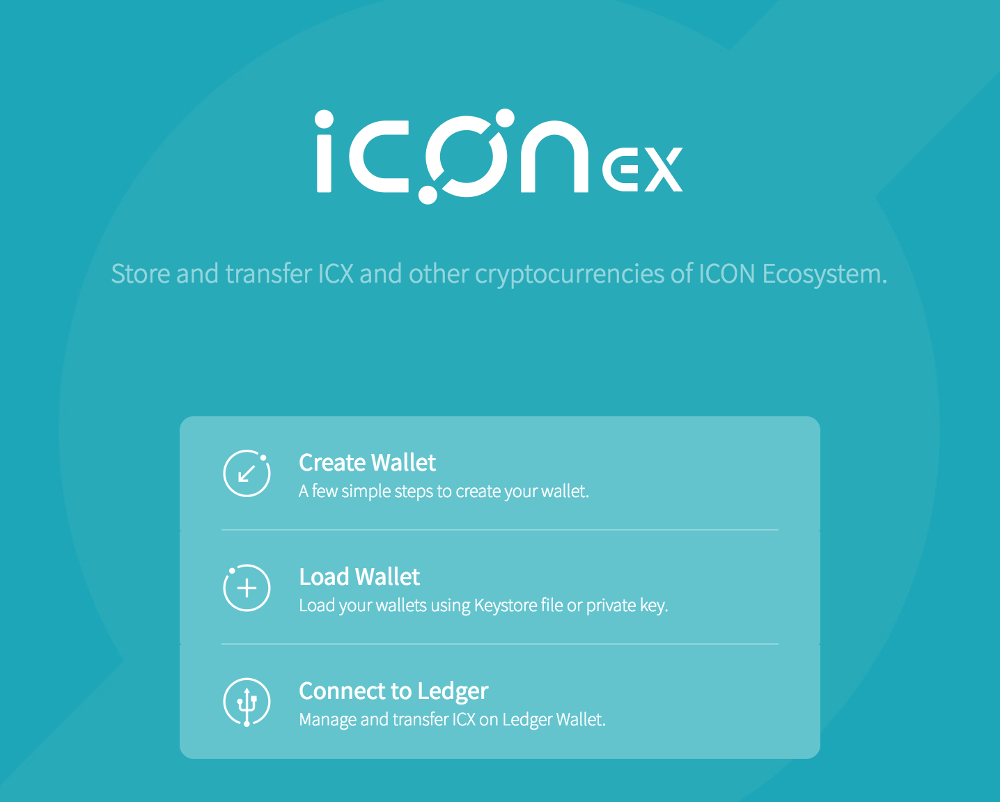
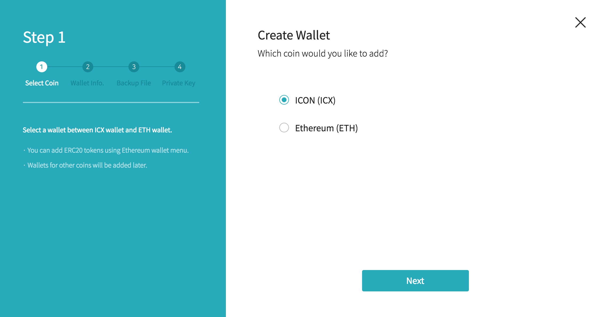
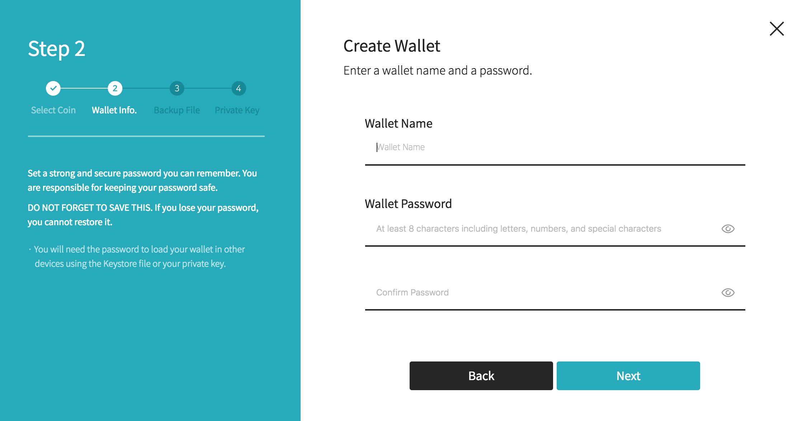
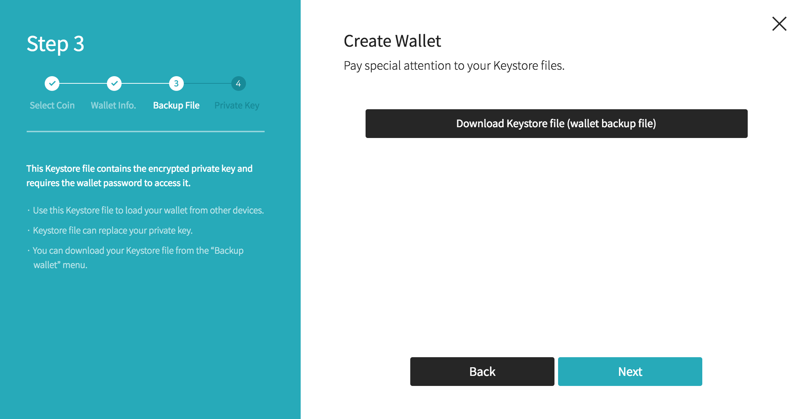
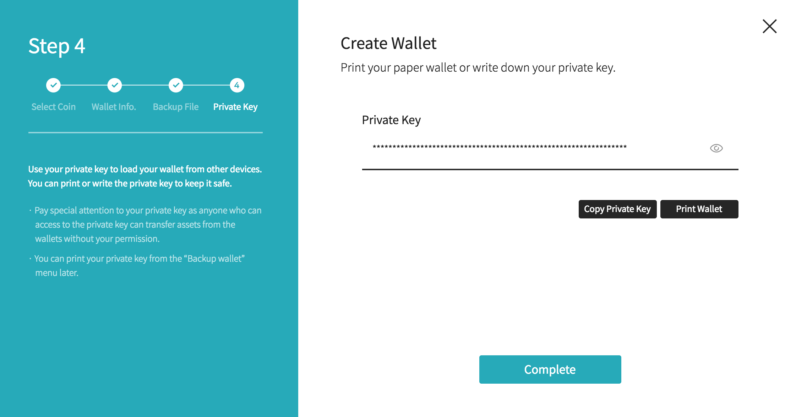

Account Management
==============

## Account
There are two types of accounts in ICON, accounts that are associated with users, often dubbed as Externally Owned Accounts (EOA), and Smart Contract (SCORE) Accounts. An EOA address starts with "hx" followed by a 20-byte hex string, while a Smart Contract Account address starts with "cx" followed by a 20-byte hex string. 

In order to deploy a SCORE on the ICON network or make a transaction, one must hold a valid EOA. Furthermore, when we say account in this document, it means EOA. The terms of EOA, wallet, and keystore are not exactly same, but are often used interchangeably. 

An account is cryptographically defined by a private-public key pair, and the account address can be derived from its public key. Creating an account is equivalant to creating a key pair, and the account can be exported as a file known as a keystore file. 

## Keystore file
A keystore file is a JSON text file containing your private key and address. The private key is encrypted with the password that you enter when you create an account or keystore file. If you lose your keystore file and password, there is no way to recover them. You will lose you account and the assets you own.

A keystore file is used to authenticate a user. Every transaction must be signed with your private key. If your private key is leaked, anyone possessing the private key can access your account and sign the transaction on your behelf. Therefore, it is always recommended to use a keystore file instead of a plain private key. 

## Create an account
There are several ways to create an account. 

### Using T-Bears
You can create a keystore file from CLI using `tbears keystore` command. 
```bash
$ tbears keystore [keystore_file_name]
Input your keystore password : 
Retype your keystore password : 

Made keystore file successfully
```

### Using Python SDK
#### Create an account
KeyWallet is an object representing an account. The code below creates a new KeyWallet instance. Internally, a private-public key pair is generated. 

```python
wallet = KeyWallet.create()
```
#### Load existing account
```python
# load existing account using private key
key = bytes.fromhex(userPrivateKey)
wallet = KeyWallet.load(key)

# load existing account from keystore file
wallet = KeyWallet.load(keystoreFilePath, password)
```
#### Export keystore file
```python
wallet.store(destinationFilePath, password)
```

### Using Java SDK
#### Create an account
```java
KeyWallet wallet = KeyWallet.create()
```
#### Load existing account
```java
// load existing account using private key
Bytes key = new Bytes(userPrivateKey)
KeyWallet wallet1 = KeyWallet.load(key);

// load existing account using keystore file
File file = new File(destinationDirectory, filename);
KeyWallet wallet2 = KeyWallet.load(password, file);
```
#### Export keystore file
```java
// path to store the keystore file. keystore file name is automatically generated. 
File destinationDirectory = new File("./"); 

// keystore file password 
String password = "password_string"; 

String fileName = KeyWallet.store(wallet, password, destinationDirectory);
```

### Using ICONex
ICONex is a Chrome extention app. [Installing ICONex](https://chrome.google.com/webstore/detail/iconex/flpiciilemghbmfalicajoolhkkenfel)

#### Create an account and download keystore file.
1. Click "Create Wallet". 


2. Select "ICON (ICX)"


3. Enter a wallet name and password. 


4. Download the keystore file for backup. 


5. Confirm your private key and keep it safe.



#### Load existing account

1. Click "Load Wallet".

2. You can load your account from the keystore file ("Select wallet file") or using a private key ("Enter Private Key").


