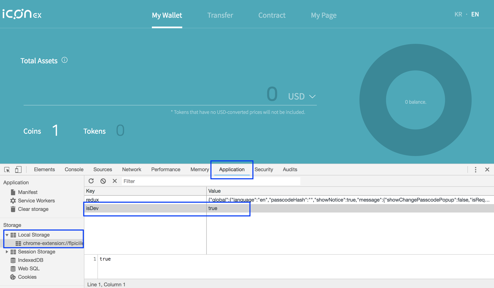
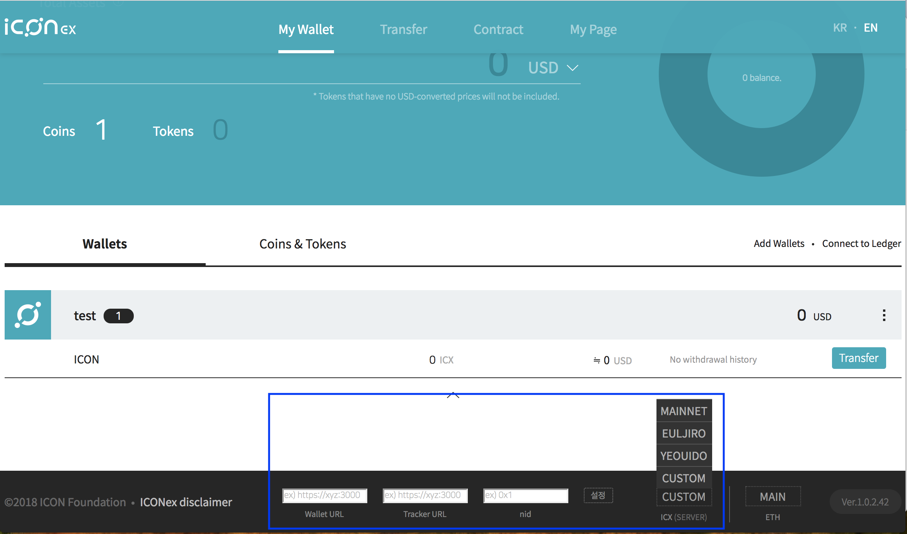

## How to change network in ICONex Chrome extension
- Open the Chrome DevTools by pressing F12, then go to the **Application** tab. In the **Storage** section, expand **Local Storage**. 
- Add a new key/value pair, **isDev/true**, by clicking on the empty row at the bottom of the table.

- Reload your wallet, then you will see the menu in the bottom. Click the **ICX (SERVER)** button to open the dropup list of the available networks. You can choose predefined one, or manually set a custom node. 

 

