# SCORE Deploy Guide
This document explains the deploy process of SCORE (Smart Contract on Reliable Environment) in the ICON network.

Distribution of SCORE is possible through T-Bears, and DAPP developers will need a wallet to pay the transaction fee. Update of SCORE that has already been distributed is only possible through the same wallet address. 

SCORE, which runs on the ICON network, may attack the ICON network intentionally or by mistake. The ICON network adops the SCORE audit process to prevent many from being attacked by the few in advance. SCORE audit is conducted on ICON Mainnet only.

The auditor(s) of ICON network conduct pre-investigation on SCORE deployed by DAPP developers to determine risk factors. SCORE can be "accepted" or "rejected," and only SCORE that has been "accepted" by the auditor can operate in the ICON network.

Next is the state diagram of SCORE. If DAPP developers request to deploy the SCORE through T-Bears, the SCORE will be registered as “pending” in the ICON network. It will be installed only after it is accepted by the auditor. If it is determined that it poses a threat to the ICON network, auditor will “reject” the SCORE. Once activated, initial deployer can update the SCORE, and the previous SCORE will remain active while the updated SCORE is in pending status.

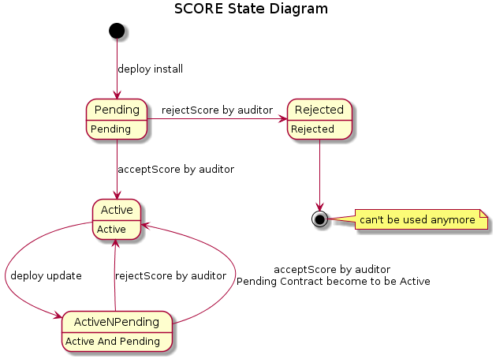

## Preparation
For the DAPP developer to deploy SCORE, the developer must have a wallet with amount enough to pay the service fee.

### T-Bears
Please refer to [ICON SCORE development suite (tbears) TUTORIAL](https://github.com/icon-project/t-bears/blob/master/README.md) and install.

### Wallet
You can create a wallet in ICONex.

ICONex can be accessed in the Wallet menu of https://icon.foundation/ and installed as a chrome extension. You can deposit a certain amount of ICX, and transacton fee will be deducted from your balance. After creating the wallet, you can back up the keystore file, which will be used when deploying the SCORE from T-Bears CLI.

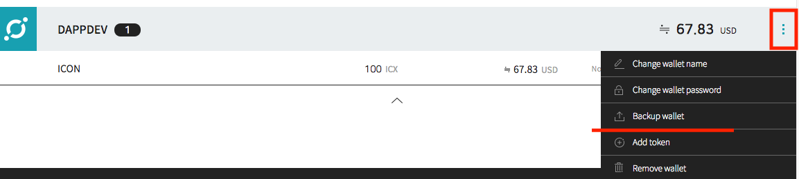

Keystore file can be created in T-Bears as well, and in this case, you can import the keystore file into ICONex. 

```bash
(work) $ tbears keystore key_DAPPDEV.txt

input your key store password:

Made keystore file successfully

```
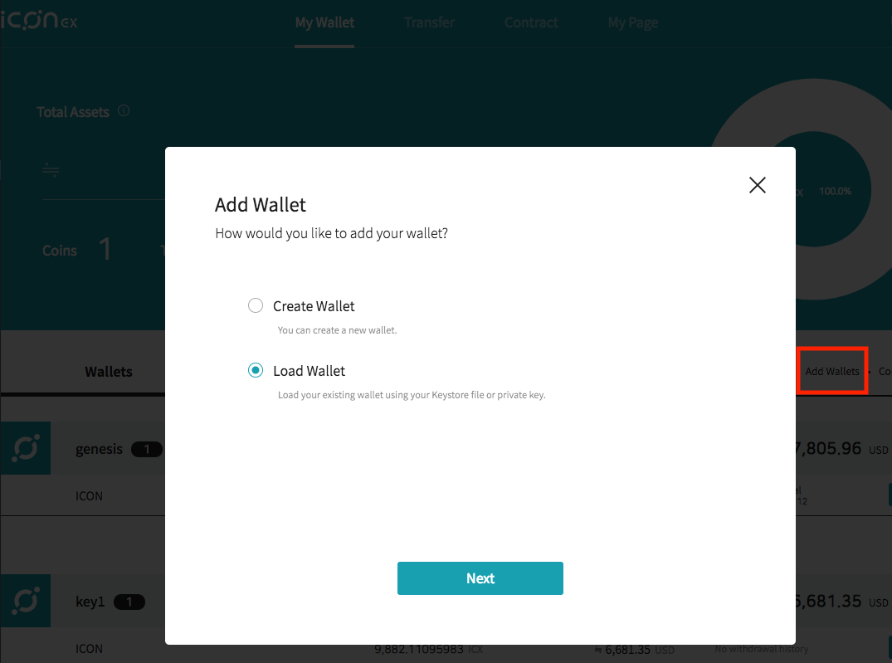

### Tracker
ICON network provides a tracker (https://tracker.icon.foundation/), which enables you to access the status of any block and transaction. 

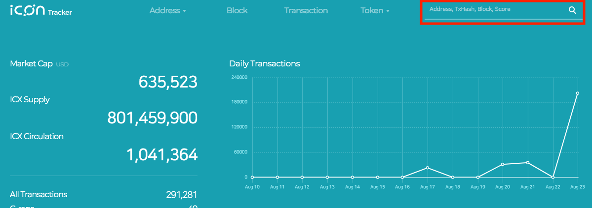

## Deploy

### tbears deploy install
Open `tbears_cli_config.json` file, and make sure `keyStore`, `contentType`, `mode` and `uri` values are correct.

In `uri`, you set the uri of Mainnet, while in `keyStore`, you should set the path to the keystore file. 

```text
{
"uri": "http://wallet.icon.foundation:9000/api/v3",
"nid": "0x3",
"keyStore": "key_DAPPDEV.txt",
"from": "hxaaaaaaaaaaaaaaaaaaaaaaaaaaaaaaaaaaaaaaaa",
"to": "cx0000000000000000000000000000000000000000",
"stepLimit": "0x300000",
"deploy": {
    "contentType": "zip",
    "mode": "install",
    "scoreParams": {}
},
"txresult": {},
"transfer": {}
}

```
Deploy the SCORE of your choice. In the following, SCORE named "abc" was deployed. 

```bash
(work) $ tbears deploy abc

input your key store password:

Send deploy request successfully.

transaction hash: 0x469fce37cf1e7fb9892e1333a15d4e20f86e8f010b56fe0708bd89246dedcfbf
```
You can verify the result of SCORE deployment by the transaction hash (the result of the command above) in tracker.

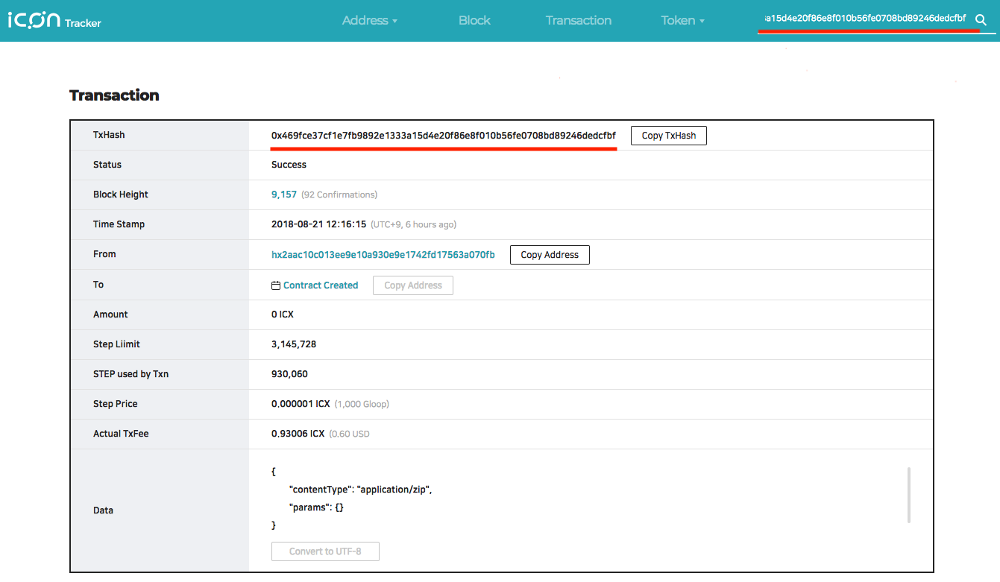

If you choose "Contract Created" in the screen above, you can check the status of SCORE audit. The status is "pending" until the auditor accepts it.

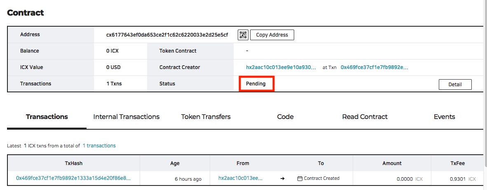

On T-Bears, you can also get the transaction results using the transaction hash. In the result, you can get the SCORE address in the `scoreAddress` field as shown below. Note that the SCORE address is assigned before passing the audit, it doesn't mean it has been accepted.

```bash
(work) $ tbears txresult 0x469fce37cf1e7fb9892e1333a15d4e20f86e8f010b56fe0708bd89246dedcfbf
 Transaction result: {
     "jsonrpc": "2.0",
     "result": {
         "txHash": "0x469fce37cf1e7fb9892e1333a15d4e20f86e8f010b56fe0708bd89246dedcfbf",
         "blockHeight": "0x1",
         "blockHash": "0x2e7012a444a49b69e7e31a6b8a5f7a38f7bd860ec5fcf896b15416169d1dc924",
         "txIndex": "0x0",
         "to": "cx0000000000000000000000000000000000000000",
         "scoreAddress": "cx7990f4e8e224e238f5eca089ebf48c5351b7ce30",
         "stepUsed": "0x216ee30",
         "stepPrice": "0x0",
         "cumulativeStepUsed": "0x216ee30",
         "eventLogs": [],
         "logsBloom": "0x00000000000000000000000000000000000000000000000000000000000000000000000000000000000000000000000000000000000000000000000000000000000000000000000000000000000000000000000000000000000000000000000000000000000000000000000000000000000000000000000000000000000000000000000000000000000000000000000000000000000000000000000000000000000000000000000000000000000000000000000000000000000000000000000000000000000000000000000000000000000000000000000000000000000000000000000000000000000000000000000000000000000000000000000000000000",
         "status": "0x1"
     },
     "id": 1
}
```

You may notice from the result above that the command `tbears txresult` doesn't return the audit status. Furthermore, if you run `tbears scoreapi` against the SCORE address, and the SCORE is not active (pending or rejected), an error message will be returned as shown below.

```bash
(work) $ tbears scoreapi cx6177643ef0da653ce2f1c62c6220033e2d25e5cf
Can not get cx6177643ef0da653ce2f1c62c6220033e2d25e5cf's API
{
    "jsonrpc": "2.0",
    "error": {
        "code": -32602,
        "message": "SCORE is inactive: cx1e0135cff7fa06be17840badc9ad7144b4c82606"
    },
    "id": 1   
}
```

As you cannot review your SCORE audit status using tbears CLI until the SCORE is active, as a workaround you can check the SCORE audit status on the tracker.
The SCORE status will become 'active' only when the auditor accepts the audit result.

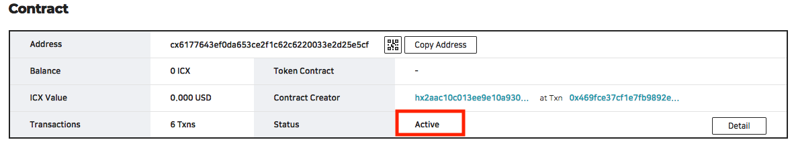

Once active, `tbears scoreapi` will return the valid result as shown below (actual result may vary depending on the implementation). At this point, the SCORE is actually running on the ICON network. 

```
(work) $ tbears scoreapi cx6177643ef0da653ce2f1c62c6220033e2d25e5cf
SCORE API: [
    {
        "type": "fallback",
        "name": "fallback",
        "inputs": []
    },
    {
        "type": "function",
        "name": "hello",
        "inputs": [],
        "outputs": [
            {
                "type": "str"
            }
        ],
        "readonly": "0x1"
    }
]
```

### tbears deploy update
Initial deployer can update the SCORE. 

You can execute `tbears deploy` command with -m option, or set deploy mode to 'update' in 'tbears_cli_config.json' file.

```text
"deploy": {
    "mode": "update",
}
```

```bash
(work) $ tbears deploy -m update -o cx6177643ef0da653ce2f1c62c6220033e2d25e5cf abc

input your key store password:

Send deploy request successfully.

transaction hash: 0x95fd26a68ea60fe223a9a80cf5a54ab0cb7a895d65fa4836a2fc74380b230c54
```
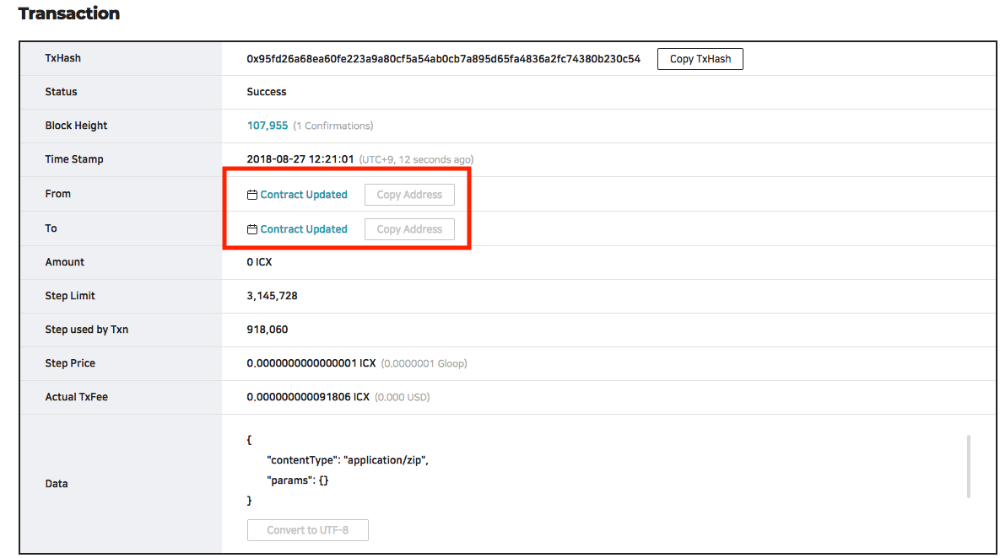

If you click "Contract Updated" in the screen above, you can see the detail screen of the SCORE. You can see the state of the current SCORE, which is "active". In the transaction list, you can see "Contract Updated", which means it is in "pending" status. After audit finishes, "Contract Accepted" or "Contract Rejected" transaction will appear.

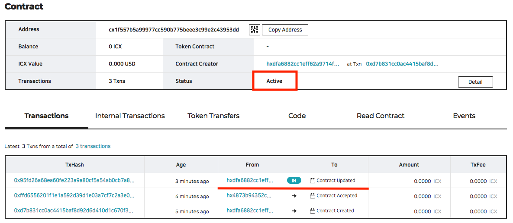

## Audit Rejected
When SCORE is rejected by the auditor, the SCORE status becomes "Rejected". You can check the status in the tracker's Contract detail screen.

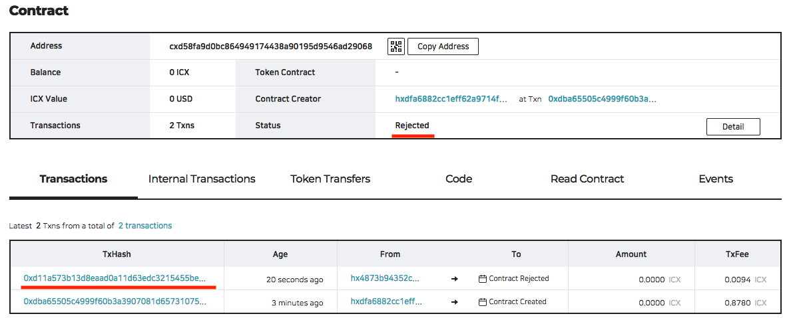
You can see the detailed reason of rejection in reject transaction. 

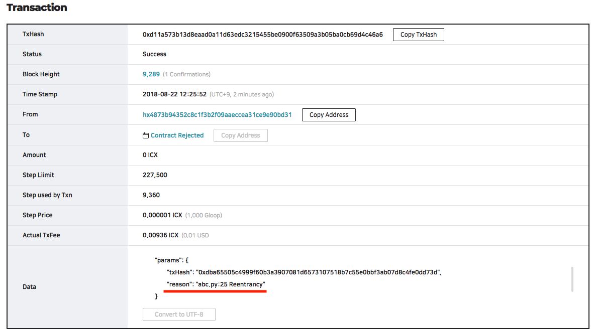

If SCORE update is rejected, then previous SCORE remains active. 

## Common Errors
- If you cannot pay the transaction fee,

```bash
(work) $ tbears deploy abc

input your key store password:

Got an error response
{'jsonrpc': '2.0', 'error': {'code': -32600, 'message': 'Out of balance'}, 'id': 1}
```

- Only the initial deployer can update the SCORE. If you use a different wallet during `deploy update`,

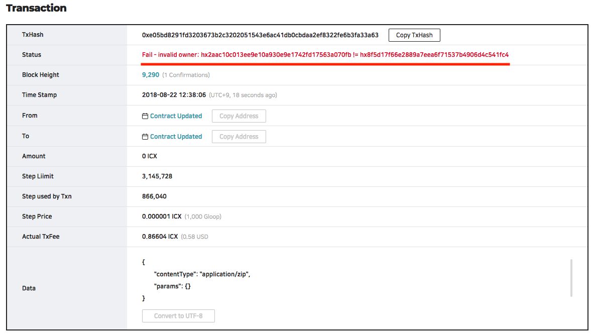

- If you  `deploy update` a SCORE that is not active,

```bash
(work) $ tbears deploy -m update -o cx06a427d41e87612c27c3caa2f1d7444c69781dc9  abc

input your key store password:

Got an error response

{'jsonrpc': '2.0', 'error': {'code': -32600, 'message': 'cx06a427d41e87612c27c3caa2f1d7444c69781dc9 is inactive SCORE'}, 'id': 1}

```

