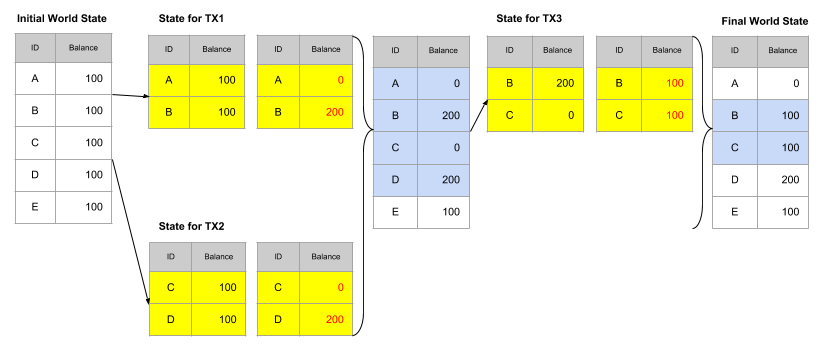
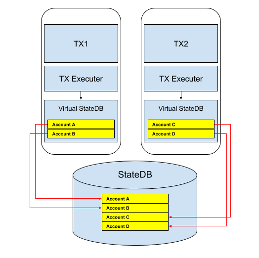

Various factors affect the blockchain performance. One of the major factors is the **execution time** of transactions. In this article, we illustrate our R&D approach to increase the blockchain performance by reducing the transaction execution time. 

## Transaction Execution Time 
Transactions Per Second (TPS) is the number of transactions that a network can process during a single second. TPS is a key metric of blockchain performance. 
Transaction can be defined from the submission to the network until it is included in the block. In ICON, the number of transactions included in a block are always guaranteed to be executed within one block generation time, so, it is a good representation of transaction throughput, and proportional to the TPS.  

TPS is mainly affected by following factors.
* Travel time of transaction to the consensus node 
* Communication time among consensus nodes
* Execution time of transaction 

Travel and communication time are network bound, and there has been continuous attempt to optimize the network protocol in blockchain. Further optimizing the network protocol is not trivial as it involves the risk of breaking the liveness and safety properties in the blockchain network.
On the other hand, reducing the execution time has not been touched yet. If we reduce the transaction execution time, we can improve the performance of blockchain without risking the network stability.

## Parallel Execution

The most straightforward approach to reduce the transaction execution time is using stronger computing power. This is called scale-up or vertical scaling. However, increasing computing power is expensive and has physical limitation. Instead, in modern computing, increasing overall throughput with the parallel execution using multiple cores is more common approach.

That said, in blockchain, sequential execution of transactions has been the norm, because, blockchain network represents a world state - a collection of accounts and their states, and every consensus node must agree on the state change after a transaction. Because previous transactions can affect the execution of the current transaction, it is safe to execute transactions sequentially.

On closer look, however, some transactions are disjoint or independent, meaning that they do not write on the same state variables within a single block time. Those independent transactions can be executed in parallel without any conflict. In the subsequent sections, we will explain more in detail how this can be implemented on two different cases.

### Coin transfer

Coin transfer can change the balance of at most three accounts at a time, they are sender, receiver, and treasury accounts.
Treasury is a special account for deposit, and we can process all the deposit requests to the treasury in bulk after executing other transactions. So, only two accounts (sender and receiver) are execution-order sensitive.

Let's take an example of following transactions in a block in the order of submission.

1) Transfer A to B: 100
2) Transfer C to D: 100
3) Transfer B to C: 100

Let T be the execution time for coin transfer. 
In sequential processing, total execution time is T x 3.
But, if we execute (1) and (2) in parallel, it takes T x 2. We know we can execute (1) and (2) at the same time, because they do not have access to the same accounts.  

We examined that if we can execute independent transactions in parallel, total execution time of the transactions in a block can be effectively reduced.
The same approach can be applied to the smart contract execution.

### Smart contract

A transaction sent to a smart contract (SCORE) is a method call.
SCORE may change the state of any account, because it can make a call to other SCORE. So, as a general statement, methods of SCORE need a write-permission to all accounts.
But, each specific method requires a limited permission to the accounts. So, if we have extra information about to which accounts the method needs an access, we can identify independent SCORE methods and execute them in parallel.

With the extra information about the method, we can create a virtual world state (a partial view to the world) for each transaction.
The transaction can only change the world state when the method is designated to do so. Otherwise, any attempt to change the world state beyond its permission will result the transaction failed.

Below diagram illustrates how the parallel execution of two transactions are managed.

After executing transactions, each environment releases the locked accounts, then other transaction can create own execution environment with the required accounts being locked.

To enable parallel processing, SCORE methods should be annotated with the required accounts. Careful design such as spliting  database and code will enhance the parallelsm. 
