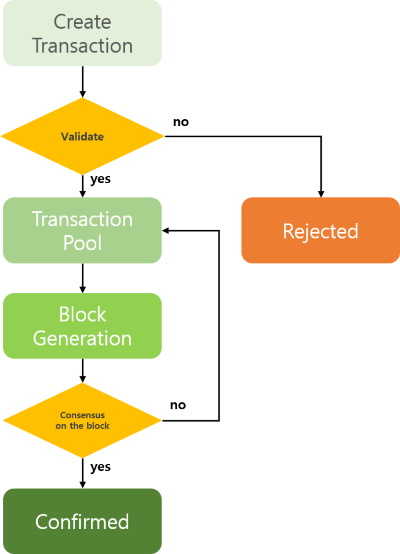

This describes the definition of a transaction in ICON, functionalities, and specification. You can get a basic understanding of transaction in ICON from this page.

## Transaction

### Definition

The term “transaction” in ICON refer to the "signed" data package which is used for changing the states of a blockchain (e.g. deploying a SCORE, ICX coin transfer, etc). A transaction always has to involve signature data.

"states of a blockchain" means all states of accounts (i.e. EOA, SCORE accounts,) which are recorded on the blockchain. 

### Purpose of Signature

- The signature prevents transaction data from forge or falsification. for example, If the transaction data is falsified while propagation, valid signature (i.e. expected valid signature data) data also change. As no one can generate the valid signature except the owner of an account who generates a transaction, this transaction will be failed while verifying a transaction. 
- Signature guarantee that a transaction data has been generated by the owner of an account.

### Function of Transaction

- ICX Coin transfer
- Record message on the blockchain
- Deploy or update SCOREs
- Change SCORE's states

### Data Model of Transaction

The table below shows the data model of a transaction and their descriptions. 

| Component        | **Description**                                              |
| ---------------- | ------------------------------------------------------------ |
| from             | EOA address that created the transaction.                    |
| to               | EOA or SCORE address to receive ICX coins, or SCORE address to execute the transactions. When deploying a SCORE, "to" address is zero SCORE address (i.e. `cx0000000000000000000000000000000000000000`) |
| value            | Amount of ICX coins to be transferred.                       |
| step limit       | A maximum amount of step which will be consumed when executing a transaction. Users can set this amount, and If all amount of step a user has set is consumed while executing a transaction, this transaction will be failed. |
| time stamp       | Transaction creation time. Outdated time will be rejected when validating a transaction. If you use the same time stamp when creating a transaction, that transaction can be rejected as the same transaction hash can be created (see the transaction hash description below). |
| nonce            | An arbitrary number used to prevent transaction hash collision (optional data). |
| nid              | ICON network ID. Each ICON network has different rules and configurations (e.g. governance rules, fee policy). so even though you try to request the same transaction with the same state of the account, the result of the transaction can be different according to the network. |
| data type        | Type of data for executing transaction. When executing a transaction, additional data is required according to the purpose of a transaction. For examples, when you call a SCORE method, you have to specify which method you want to call, arguments of the method, etc. Depending on the purpose, there are three kinds of type: `call`, `deploy`, and `message`. In the case of a simple coin transfer, the data type is omitted because there is no need for additional data. `call`: It is used when calling a function in SCORE `deploy`: It is used when installing or updating a SCORE `message`: It is used when transferring a message |
| signature        | The signature generated by the transaction sender. Generate transaction signature using above data (from, to, value, etc).  After generating the digital signature, if any of the above data is changed, it must be regenerated. The detail of generating transaction signature is defined in [How to Generate Transaction Signature](https://github.com/icon-project/documentation/blob/develop/howto/how-to-generate-a-transaction-signature.md). |
| transaction hash | Hash data which is returned after pass the validation process of the transaction (see the Life Cycle of Transaction's "Create Transaction" section below). Each transaction has a unique transaction hash. In other words, the transaction hash always has to be different from other transaction hash. |

The specific information on transaction data, see the JSON-RPC APIs "icx_sendTransaction" section of the [ICON JSON-RPC API v3 Specification](https://github.com/icon-project/documentation/blob/develop/references/json-rpc/icon-json-rpc-v3.md) documentation.

### Life Cycle of Transaction

#### Create Transaction

Create and propagate a transaction to ICON network. Propagated transaction proceed with basic syntax and signature validation, and is put into the transaction pool for being recorded to a block if they are valid.  At the same times, ICON network returns transaction hash data. If a transaction is invalid, that transaction is immediately rejected and ICON network returns an error instead of a transaction hash. A word "rejected" refers to being removed because it can not be propagated on the ICON network.

#### Transaction Pool

In this stage, a transaction is waiting in the transaction pool before being put into the block

#### Block Generation

In this stage, a transaction is put into a generated block. If the consensus is finally reached about the generated block (after consensus process), that block is connected to the blockchain, and transactions in the block are recorded permanently. If the consensus on the block is failed, all transactions in that block are removed after a certain period of time. A word "removed" refers to being disappeared from the ICON network entirely. Therefore, the user who created and propagated the transaction needs to track the transaction until it is recorded on the blockchain (i.e. confirmed).

#### Confirmed

The block which contains a transaction is connected to the blockchain after consensus process. This state of a transaction is called "confirmed". A transaction in the block is recorded permanently regardless of a transaction processing result (whether success or failure).

### How to Check Transaction State

#### Check the Transaction Validation

If you get the transaction hash as a response of sending transaction to the ICON network, this means that your transaction has passed the validation. ICON network returns the transaction hash only when a transaction is valid. The specific information about this, see the JSON-RPC APIs "icx_sendTransaction" section of the [ICON JSON-RPC API v3 Specification](https://github.com/icon-project/documentation/blob/develop/references/json-rpc/icon-json-rpc-v3.md) documentation.

#### Check the Transaction Confirmation

You can check if the transaction is confirmed or pending using "icx_getTransactionResult" JSON-RPC API. "pending" means that a transaction is on the transaction pool or block generation stage (exceptionally in the case of consensus failure on the block, it can be temporarily marked as "pending"). The specific information about this, see the JSON-RPC APIs "icx_getTransactionResult" section of the [ICON JSON-RPC API v3 Specification](https://github.com/icon-project/documentation/blob/develop/references/json-rpc/icon-json-rpc-v3.md) documentation.
