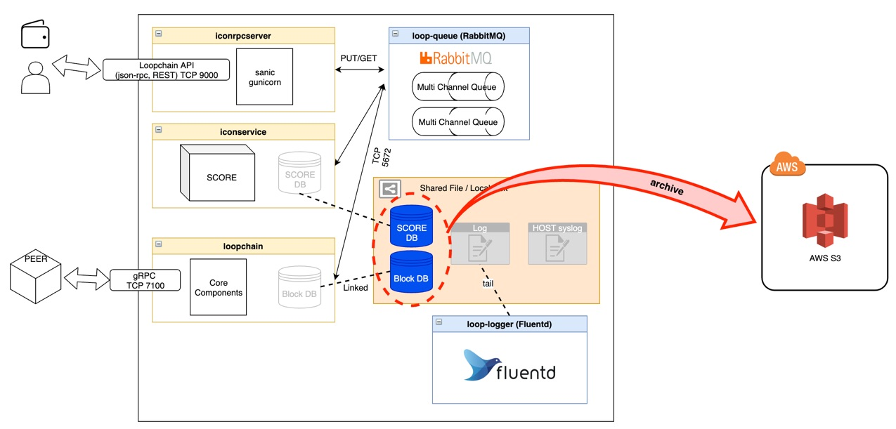

This document is a guideline about Backup and restore DB guide a Public Representative (“P-Rep”) node on the MainNet using a docker. 
P-Reps are the consensus nodes that produce, verify blocks and participate in network policy decisions on the ICON Network. 


## Intended Audience

We recommend all P-Rep candidates to go through this guideline.

## How to backup DB

Recovering with a backed-up snapshot dramatically reduces block synchronization time. <br>
The backup must be proceeded with the node suspended.




Our backup policy is as follows.
```
backup archive cycle
    Local disk : 1 week
    AWS S3 : 15 days ( deleted every day night 00:00)
```

* backup procedure
1. `Stop Node`
    - The backup must be proceeded with the node suspended.
2. `To create compressed archive files of data directory and Upload to AWS S3`
    - ./data/loopchain/.score_data
    - ./data/loopchain/.storage
3. `Start Node`


* backup script
```bash
#!/bin/bash
#
# ICON leveldb Cold-Backup script
# - requirement
#   . awscli pkg (yum install -y awscli)
#   . AWS access_key & secret_access_key
#
 
 
SERVICE=PRep
BH=`curl -s localhost:9000/api/v1/avail/peer | jq .block_height`
TODAY=`date "+%Y%m%d"`
CTIME=`date "+%H%M"`
FILE_NAME="${SERVICE}_BH${BH}_data-${TODAY}_${CTIME}.tar.gz"
PREP_DIR="/app/prep"
IP_DIR_NAME=`find ${PREP_DIR}/data/loopchain/.storage/*7100_icon_dex -maxdepth 1 -type d |awk -F\/ '{print $NF}'`
LOG_NAME="${SERVICE}_Backup_${TODAY}.log"
BACKUP_TARGET_DIR="${PREP_DIR}/data/loopchain"
BACKUP_TARGET=".score_data .storage"
BACKUP_DIR="${PREP_DIR}/data/Backup/${TODAY}"
DELETE_DIR="${PREP_DIR}/data/Backup/`date -d '1 week ago' "+%Y%m%d"`"
LOG_DIR="${PREP_DIR}/data/Backup/log"
COMPOSE_YML="docker-compose.yml"
PEER_STATUS=`curl -s -o /dev/null -w "%{http_code}" localhost:9000/api/v1/avail/peer`
S3_PATH="s3://icon-leveldb-backup/${SERVICE}"
S3_PATH_PERM="s3://icon-leveldb-backup/Permanent/${SERVICE}"
 
 
 
start_peer()
{
    echo -e "[`date "+%Y-%m-%d %H:%M:%S"`] Starting Peer..."
    cd ${PREP_DIR}
    docker-compose -f ${COMPOSE_YML} up -d
}
 
stop_peer()
{
    echo -e "[`date "+%Y-%m-%d %H:%M:%S"`] Stoping Peer..."
    cd ${PREP_DIR}
    docker-compose -f ${COMPOSE_YML} down
}
 
run_backup()
{
    echo -e "[`date "+%Y-%m-%d %H:%M:%S"`] Start Backup"
    cd ${BACKUP_TARGET_DIR}
    tar -zcf ${FILE_NAME} \
        --xform="s|.storage/${IP_DIR_NAME}|.storage/db_CHANGEIP:7100_icon_dex|" ${BACKUP_TARGET}
    if [ ! -d ${BACKUP_DIR} ]; then
        mkdir -p ${BACKUP_DIR}
    fi
    mv ${FILE_NAME} ${BACKUP_DIR}
    cd ${BACKUP_DIR}
    aws s3 cp ${BACKUP_DIR}/${FILE_NAME} ${S3_PATH}/${TODAY}/${FILE_NAME}
    aws s3 ls ${S3_PATH} --recursive | grep -v backup_list | sort -r | awk -F\/ '{print $2"/"$3}' > ${BACKUP_DIR}/backup_list
    aws s3 cp ${BACKUP_DIR}/backup_list ${S3_PATH}/backup_list
    echo -e "[`date "+%Y-%m-%d %H:%M:%S"`] End Backup"
}
 
run_main()
{
    echo -e "[`date "+%Y-%m-%d %H:%M:%S"`] Start Script"
    if [ $PEER_STATUS == 000 ]; then
        echo -e "\nWarning!! Service is not running!!"
        echo -e "Backup Skip. Next schedule running backup after sync...\n"
        stop_peer
        start_peer
    else
        echo " - Block Height is [ ${BH} ] "
        stop_peer
        sleep 10
        run_backup
        start_peer
    fi
    if [ ${CTIME} == 0000 ]; then
        echo -e "Delete old directory : ${DELETE_DIR}"
        rm -rf ${DELETE_DIR}
        echo -e "[`date "+%Y-%m-%d %H:%M:%S"`] Start Permanent Backup"
        aws s3 cp ${BACKUP_DIR}/${FILE_NAME} ${S3_PATH_PERM}/${TODAY}/${FILE_NAME}
        echo -e "[`date "+%Y-%m-%d %H:%M:%S"`] End Permanent Backup"
    fi
    echo -e "[`date "+%Y-%m-%d %H:%M:%S"`] End Script"
    echo -e "====================================================================="
}
 
if [ ! -d ${LOG_DIR} ]; then
    mkdir -p ${LOG_DIR}
fi
 
run_main >> ${LOG_DIR}/${LOG_NAME} 2>&1

```

## How to restore from snapshot
* restore procedure
1. `Stop Node`
2. `Remove Data`
    * rm -rf ./data/loopchain/.s*
3. `Download backup file from AWS S3`
4. `Unarchive backup file and change the directory names`
    * ./data/loopchain/.storage/db_{YOUR_NODE_IP}:7100_icon_dex 
5. `Start Node`

## Restore script
```bash
#!/bin/bash
RED='\033[0;31m'
GREEN="\033[1;32m"
BLUE="\033[1;34m"
NOCOLOR="\033[0m"
 
PREP_DIR="/app/prep"
RESTORE_DIR="${PREP_DIR}/data/loopchain"
 
ORIGIN_IP=`curl -s -k  https://ipinfo.io/ | jq -r .ip`
 
S3_PATH="https://s3.ap-northeast-2.amazonaws.com/icon-leveldb-backup/PRep"
 
## Var Check
if [[ $1 == "" ]]; then
    NOW_IP=$ORIGIN_IP
else
    NOW_IP=$1
fi
 
## Process Check
if [ 0 != `ps -ef | grep -v grep | grep -E "icon_service|loopchain" | wc -l`  ]; then
    echo -e $RED"Process running " $GREEN
    ps -ef | grep -v grep | grep icon
    echo -e $RED"stop Process please" $NOCOLOR
        exit 0
fi
 
## IP Check
if [[ ! $NOW_IP =~ ^(([0-9]|[1-9][0-9]|1[0-9]{2}|2[0-4][0-9]|25[0-5])\.){3} ]]
   then
        echo -e $RED"IP info Fault $NOCOLOR"
        exit 0
fi
 
function trapshell {
     echo -e "$RED STOP SHELL $NOCOLOR"
     exit 0;
}
 
function package_install {
    echo -e "$GREEN #### PHASE 1 #### \n Package Install axel pigz $NOCOLOR"
    if [ -f /etc/redhat-release ]; then
        echo -e "$GREEN OS: centos \n Package cmd: yum install -y axel pigz$NOCOLOR"
        yum install -y axel pigz > /dev/null 2>&1
    elif [ -f /etc/lsb-release ]; then
        echo -e "$GREEN OS: ubuntu \m Package cmd: apt install -y axe pigz$NOCOLOR"
        apt install -y axel pigz > /dev/null 2>&1
    else
        echo "$GREEN Not Support OS $NOCOLOR"
    fi
}
 
function Download_Backup {
    icon_latest=`curl -s ${S3_PATH}/backup_list | head -n 1`
    filename=`echo $icon_latest | awk -F/ '{print $NF}'`
    rm -rf $RESTORE_DIR
    mkdir -p $RESTORE_DIR
    echo -e "$GREEN \n\n\n #### PHASE 2 #### \n Down Load Backup File "$filename "\n\n\n " $BLUE & axel -a ${S3_PATH}/$icon_latest --output $RESTORE_DIR/$filename
}
 
function Restore_DB {
    echo -e "$GREEN #### PHASE 3 #### \n Restore process "$filename "\n\n\n $NOCOLOR"
    tar -I pigz -xf $RESTORE_DIR/$filename -C $RESTORE_DIR
    mv $RESTORE_DIR/.storage/db_CHANGEIP\:7100_icon_dex/ $RESTORE_DIR/.storage/db_$NOW_IP:7100_icon_dex
}
 
trap  trapshell 1 2 15
package_install
Download_Backup
Restore_DB
 
 
echo -e "$BLUE DONE.  $NOCOLOR"
```

## prep-node's directory structure

* Diretory structure
```
{P-Rep Install Directory}
└── data
    └── loopchain
        ├── log
        ├── .score_data
        │   ├── db
        │   │   ├── icon_dex
        │   │   ├── iiss               # IISS DB
        │   │   ├── meta               # iconservice metadata DB
        │   │   └── rc                 # reward calculator DB
        │   └── score                  # state DB
        └── .storage
            └── db_{IP}:7100_icon_dex  # block DB
```

```
IISS DB - IISS DB for calculating compensation amount by account transfer to reward calculator 
metadata DB - Internal Data Storage for ICON Service without Consensus
RC DB - `RC DB` will be stored I-Score value of each account from `reward calculator`  
state DB - SCORE data DB
block DB - block data DB
```