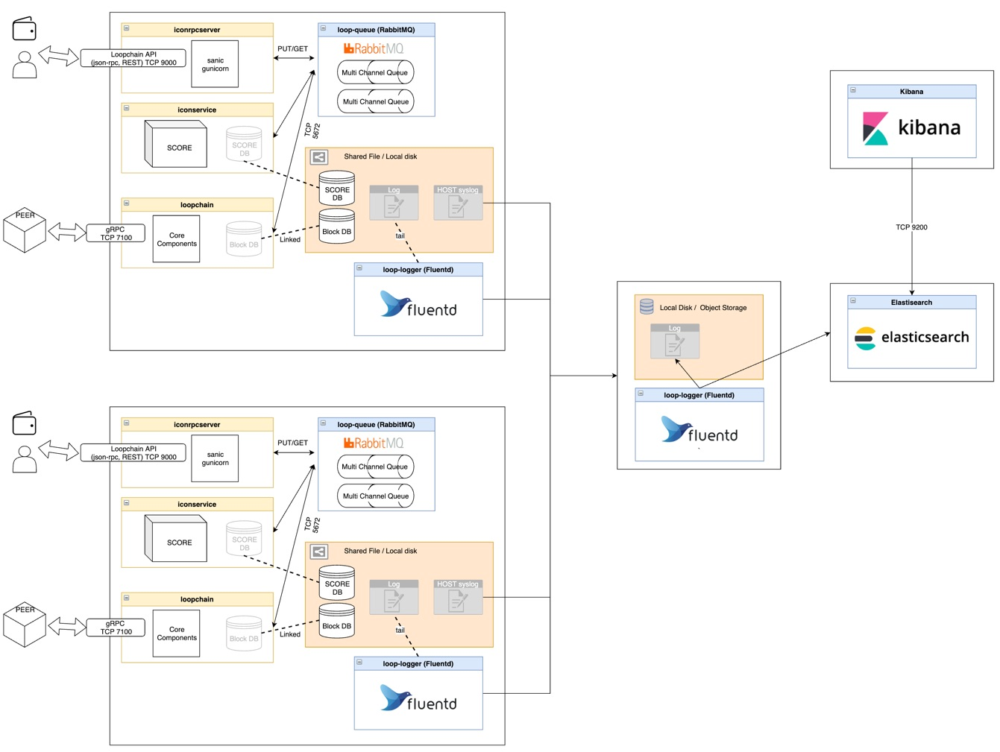
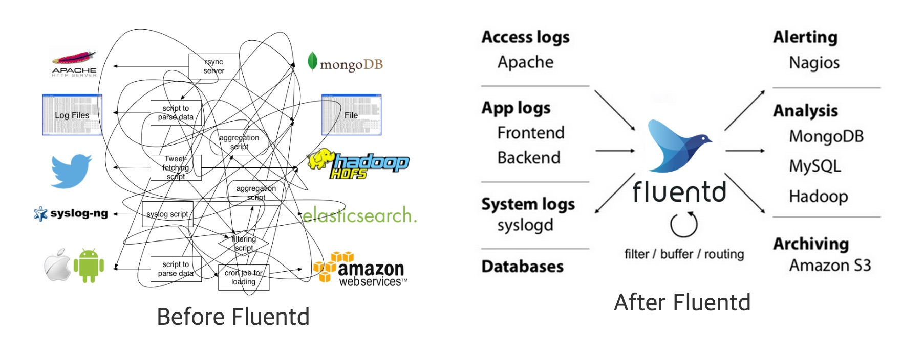
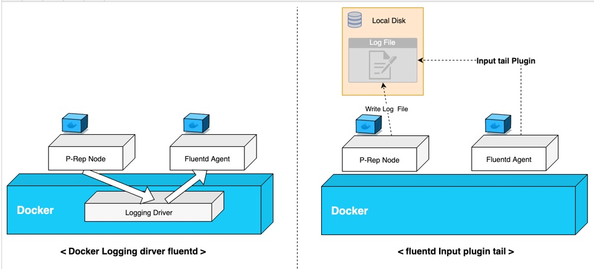
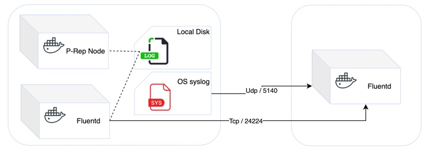

This document is a guideline about How to collect centralized logging on the MainNet.

## Intended Audience

We recommend all P-Rep candidates to go through this guideline.

## Purpose

This section describes how to use `fluentd` to collect/ manage/ and analyze logs generated when a node is running.

P-Rep node will create a log file as noted below. 
The log file can be used to identify service operation information and cause of failure. 

## Pre-requisites
We assume that you have previous knowledge and experience in:

- IT infrastructure management
- Linux or UNIX system administration
- Linux server and docker service troubleshooting
- Docker container


#### Description of log files in prep-node

|service name| log file name |
|------|-----|
|docker container booting |	booting.log|
|iconrpcserver|	iconrpcserver.log|
|iconservice|	iconservice.log|
|loopchain|	loopchain.channel-txcreator-icon_dex_broadcast.icon_dex.log|
| |loopchain.channel-txcreator.icon_dex.log|
||loopchain.channel-txreceiver.icon_dex.log|
||loopchain.channel.icon_dex.log|

The logs can be managed on the local disk.
However, in order to manage the old log files and the large log files, the log should be kept in a separate space. In addition, multiple nodes may be operated depending on network modeling. It is recommended to collect and analyze logs from the central server rather than accessing the server each time to check the logs of multiple nodes. 

#### Logging architecture
The below diagram shows the architecture of log collection/analysis method using Fluent, Elasticsearch, and Kibana.



Now, let’s look at the guide of how to collect logs using Fluentd. 

### Fluentd Log Collection Method 
#### What is Fluentd?
Fluentd is an open-source data collection software licensed under Apache 2.0. It is written in a combination of C and Ruby, and supports memory and file-based buffering to prevent data loss between the nodes. It structures all the data formats coming from multiple sources in JSON format. Fluentd has 7 types of plugins: Input, Parser, Filter ,Output, Formatter, Storage, Buffer, and etc. 


* Fluentd architecture (Source: https://www.fluentd.org)


* How to Collect Fluentd Agent Logs in Docker
There are two ways of collecting logs. The first one is to set the docker logging driver to Fluentd. The second way is to collect the logs using the tail of fluentd input plugin. We recommend using the second method, using the input plugin, rather than using the docker logging driver. If you use the docker logging driver, you may experience delays in fluentd containers, or container problems that will affect P-Rep container performance. In the case of using input plugin, there is no connection point between Fluentd container and P-Rep container. So there will be no effect on the performance even if the fluentd problem occurs. 




#### Installation 
##### Prerequisite 
* Install Docker and Check P-Rep Docker Container Environment Variables

You need to check the value of the ICON log setting in the Docker Container Environment Variable. If you use the default setting, you can use it without any modification. In case of changing the setting value of console to use, change the setting value to either file or console\file and then proceed. 

|Environment Name | Value |
|---|---|
|LOG_OUTPUT_TYPE	| `file` or `console\|file` - Check the Firewall <br> The following port open is required from the agent to the server.  Udp port open is also required for syslog collection.|

|Source |Destination|Port|Description|
|----|----|----|----|
|P-Rep Node Server IP| Central log server IP	| TCP / 24224	| required port on transfer to data|
|||UDP / 5140|	option|


* Installation
To configure the collection server, Fluentd with Agent role and server role is required. Each node requires Agent role of Fluentd distributed and log file will be delivered to Fluentd server through the agent. Although it is possible to install RPM / DEB package on the server for agent installation, it is difficult to maintain such a plugin management/deployment/installation. 

* `docker-compose-fluent.yml` for Agent
Docker-Compose information is same as below when setting agent, and some modifications are required when creating a file. 

  1. P-Rep node path needed (line number 9)     :   `./data/:/loopchain/log`
  2. Fluent log and buffer file path needed (n10)   : `./fluent/log:/fluentd/log`
  3. Fluent central log collection server needed (n12)       :  ` LOG_SERVER_IP: 1.1.1.1 `

```yaml
version: '3'
services:
   loop-logger:
      image: looploy/fluentd
      container_name: loop_logger
      restart: always
      network_mode: host
      volumes:
         - ./data/:/loopchain/log
         - ./fluent/log:/fluentd/log
      environment:
         LOG_SERVER_IP: 1.1.1.1
```

* `docker-compose-fluent.yml` for Collection Server
When setting the server, Docker-compose information is the same as below and some modifications are required when creating a file. 

  1. Path for storing collected log files (n9)                        :    `./fluent/log:/fluentd/log`
  2. Run in Fluentd server mode (n11)                        :    `FLUENTD_MODE: sever `
  3. Elesticsearch Server IP Settings is required (n12)             : `FLUENTD_MATCH_ELA_HOST: 1.1.1.1`

```
version: '3'
services:
   loop-logger:
      image: looploy/fluentd
      container_name: loop_logger
      restart: always
      network_mode: host
      volumes:
         - ./fluent/log:/fluentd/log
      environment:
         FLUENTD_MODE: sever
         FLUENTD_MATCH_ELA_HOST: 1.1.1.1
```
* environment variable options

|environment variable|default|Description|
|----|----|----|
|FLUENTD_MATCH_ELA_HOST	| Elasticsearch IP Information|
|FLUENTD_MATCH_ELA_PORT|	9200|	Elasticsearch Port Information|
|FLUENTD_MODE|	agent	| Change Fluent Active Mode depending on setting variable (agent \| server \| manual ) <br> Fleunt.conf volume mount is required for manual configuration (Docker path : /fluentd/etc/fluent.conf)|
|FLUENTD_SYSTEM_WORKERS|	4	|system worker variable in server mode|
|LOG_SERVER_IP	| |Fleuntd Central Collection Server IP Information|
|LOG_SERVER_PORT	|24224|	Fluentd Central Collection Server Port Information|
|SYSLOG_SERVER_PORT |	5140|	UDP Port information used for Syslog Collection|
