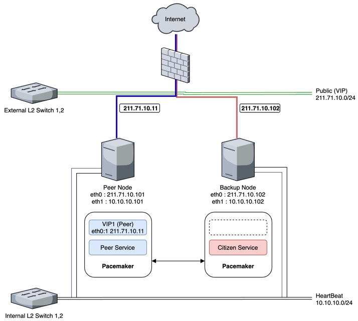
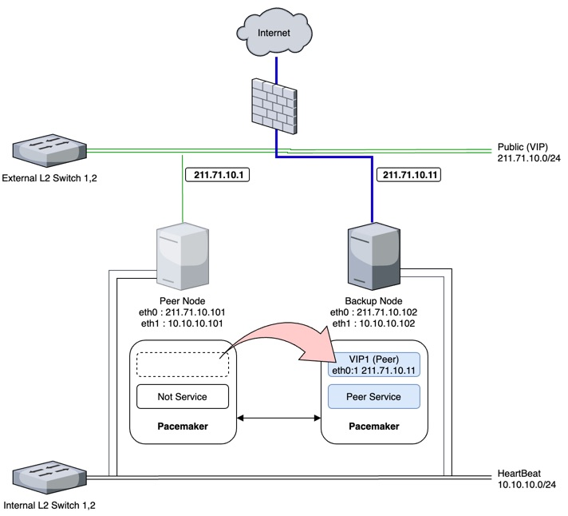

This document is a guideline detailing how to design a network with high availability of a Public Representative (“P-Rep”) node on the MainNet using docker. 
P-Reps are the consensus nodes that produce, verify blocks, and participate in network policy decisions on the ICON Network. 


## Intended Audience

We recommend all P-Rep candidates to go through this guideline.


### Network design for high availability

>High availability (HA) is a characteristic of a system, which aims to ensure an agreed level of operational performance, usually uptime, for a higher than normal period.
>Modernization has resulted in an increased reliance on these systems. For example, hospitals and data centers require high availability of their systems to perform routine daily activities. Availability refers to the ability of the user community to obtain a service or good, access the system, whether to submit new work, update or alter existing work, or collect the results of previous work. If a user cannot access the system, it is – from the users point of view – unavailable.[1] Generally, the term downtime is used to refer to periods when a system is unavailable.
>
> - Wikipedia Reference

A P-Rep needs to maintain a highly available network.
We recommend utilizing PaceMaker to do so in an Active/Backup format.
#### Pacemaker introduction 
Pacemaker is a high availability resource manager with various functionalities.
* Detects system and application error and recover.
* Supports various duplicate set-up.
* Supports quorum and resource-based cluster.
* Supports quorum loss recovery in case of multiple system failure.
* Enables customization of application launch and shutdown order.
* Enables an application to run over multiple computers.
* Supports various versions such as Master or Slave.
* Runs properly under an error or cluster status.
* Enables simulation of a specific scenario offline prior to an actual situation.
Please find more details about Pacemaker from the Red Hat Enterprise Linux 7 High Availability add-on documentation.

If you want to get more detailed information, refer to the link below
> https://clusterlabs.org/pacemaker/
> https://access.redhat.com/documentation/en-us/red_hat_enterprise_linux/7/html/high_availability_add-on_administration/ch-startup-haaa


##### Pacemaker Network
Below is the Active/Backup model built over Pacemaker.

Below is Active status


Below is Standby status



>Internal L2 Switch 1,2 : 
>Management - Detects H/W error (Hang) or FailOver.
>HeartBeat - Detects S/W error (network,process,daemon) or FailOver.
>
>External L2 Switch 1,2 : 
>Transmit to VIP allocated by Pacemaker when a Peer IP or Domain is called
>
> Peer Node :  active node
> 
> Backup Node : A backup node run a citizen

* You need three public IP address. ( Bellow IP is random )

|Node-Type|Public IPaddr |Connected status | Description|
|----|----|----|----|
|Active-Node| 211.71.10.11| Public VIP | Pacemaker assigns Virtual IP address to eth0:1<br>IP address used for connection among P-Rep nodes (p2pEndpoint).<br>Pacemaker assigns this IP address to Backup-node when Active-node failure begins.|
|Active-Node|211.71.10.101| connected eth0 | Assign IP address to eth0|
|Backup-Node|211.71.10.102| connected eth0| Assgin IP address to eth0 <br>Even when run as Backup-Node, it needs to be able to communicate between external network and run a citizen| 

##### PaceMaker H/A Process

###### Normal
> Peer Node : Run Peer resource (VIP1, Peer Daemon)
> Backup Node : Run Ctz resource (VIP2, Citizen Daemon)

###### Error (Detects Pacemaker Resource monitoring error)
> Peer Node : Shut down Peer resource (VIP1, Peer Daemon)
> Backup Node : Shut down Ctz resource (VIP2, Citizen Daemon) → Run Peer resource  (VIP1, Peer Daemon)

##### How to set up

* * Add HeartBeat, Fencing, VIP ( `/etc/hosts` )

```
[root@pcmk1 ~]# cat /etc/hosts
127.0.0.1   localhost localhost.localdomain localhost4 localhost4.localdomain4
::1         localhost6 localhost6.localdomain6
127.0.0.1 pcmk1
211.71.10.101 pcmk1
211.71.10.102 pcmk2
 
 
## PaceMaker HeartBeat
10.10.10.101 pcmk1-hb
10.10.10.102 pcmk2-hb
 
 
## VIP ##
211.71.10.11 peer-vip
```

* Create Peer Daemon (PaceMaker)

```
[root@pcmk1 ~]# cat peer.service
[Unit]
Description=Loopchain Peer
After=docker.service
 
[Service]
Type=oneshot
RemainAfterExit=yes
StandardError=null
StandardOutput=null
WorkingDirectory=/app/loopchain/bin
ExecStart=/usr/local/bin/docker-compose -f /app/loopchain/bin/docker-compose.host.yml up -d
ExecStop=/usr/sbin/pcs resource disable Ctz
ExecStop=/usr/local/bin/docker-compose -f /app/loopchain/bin/docker-compose.host.yml down
 
[Install]
WantedBy=multi-user.target
 
 
[root@pcmk1 ~]# systemctl enable peer.service
Created symlink from /etc/systemd/system/multi-user.target.wants/peer.service to /usr/lib/systemd/system/peer.service.
```

* Create Citizen Daemon Resource (PaceMaker)

```
[root@pcmk1 ~]# cat ctz.service
[Unit]
Description=Loopchain Ctz
After=docker.service
 
[Service]
Type=oneshot
RemainAfterExit=yes
StandardError=null
StandardOutput=null
WorkingDirectory=/app/loopchain/bin
ExecStart=/usr/local/bin/docker-compose -f /app/loopchain/bin/docker-compose.host.yml up -d
ExecStop=/usr/local/bin/docker-compose -f /app/loopchain/bin/docker-compose.host.yml down
 
[Install]
WantedBy=multi-user.target
 
[root@pcmk1 ~]# systemctl enable ctz.service
Created symlink from /etc/systemd/system/multi-user.target.wants/ctz.service to /usr/lib/systemd/system/ctz.service.
```

###### Package Install (Centos)
* Register Repo

```
# cat < /etc/yum.repos.d/centos.repo
[centos-7-base]
name=CentOS-$releasever - Base
mirrorlist=http://mirrorlist.centos.org/?release=$releasever&arch=$basearch&repo=os
#baseurl=http://mirror.centos.org/centos/$releasever/os/$basearch/
enabled=1
EOF
```
* yum Install (Centos)

```
# yum install pacemaker pcs resource-agents
```

###### Package Install (ubuntu)
* apt-get Install (Ubuntu)

```
sudo apt-get install pacemaker
```
 
##### Set Pacemaker (CLI)
* Create Hacluster Account Password

```
[root@pcmk1 ~]# passwd hacluster
Changing password for user hacluster.
New password:
BAD PASSWORD: The password contains the user name in some form
Retype new password:
passwd: all authentication tokens updated successfully.
[root@pcmk1 ~]#
```
* Execute PaceMaker Daemon

```
[root@pcmk1 ~]# systemctl start pcsd
 
[root@pcmk1 ~]# systemctl enable pcsd
Created symlink from /etc/systemd/system/multi-user.target.wants/pcsd.service to /usr/lib/systemd/system/pcsd.service.

```
 
##### Cluster composition 
* Initial Composition

```
[root@pcmk1 ~]# pcs cluster auth pcmk1-hb pcmk2-hb
Username: hacluster
Password:
pcmk2-hb: Authorized
pcmk1-hb: Authorized
 
[root@pcmk1 ~]# pcs cluster setup --force --name cluster pcmk1-hb pcmk2-hb
Destroying cluster on nodes: pcmk1-hb, pcmk2-hb...
pcmk1-hb: Stopping Cluster (pacemaker)...
pcmk2-hb: Stopping Cluster (pacemaker)...
pcmk1-hb: Successfully destroyed cluster
pcmk2-hb: Successfully destroyed cluster
 
Sending 'pacemaker_remote authkey' to 'pcmk1-hb', 'pcmk2-hb'
pcmk1-hb: successful distribution of the file 'pacemaker_remote authkey'
pcmk2-hb: successful distribution of the file 'pacemaker_remote authkey'
Sending cluster config files to the nodes...
pcmk1-hb: Succeeded
pcmk2-hb: Succeeded
 
Synchronizing pcsd certificates on nodes pcmk1-hb, pcmk2-hb...
pcmk2-hb: Success
pcmk1-hb: Success
Restarting pcsd on the nodes in order to reload the certificates...
pcmk2-hb: Success
pcmk1-hb: Success
[root@pcmk1 ~]#
 
 
[root@pcmk1 ~]# pcs cluster start --all
pcmk1-hb: Starting Cluster (corosync)...
pcmk2-hb: Starting Cluster (corosync)...
pcmk2-hb: Starting Cluster (pacemaker)...
pcmk1-hb: Starting Cluster (pacemaker)...
 
[root@pcmk1 ~]# corosync-cfgtool -s
Printing ring status.
Local node ID 1
RING ID 0
    id  = 192.168.56.108
    status  = ring 0 active with no faults
```

* Set Up Temporary Stonith During Composition

```
[root@pcmk1 ~]# pcs property set stonith-enabled=false
[root@pcmk1 ~]# crm_verify -L -V
[root@pcmk1 ~]# pcs property
Cluster Properties:
 cluster-infrastructure: corosync
 cluster-name: cluster
 dc-version: 1.1.16-12.el7-94ff4df
 have-watchdog: false
 stonith-enabled: false
```

> :warning: **Warning**: SONITH is in enable status by default after initial installation. This error is due to false setting of STONITH (Feincing).<br>
Before STONITH (Fencing) setting, set False as below and proceed to installation. 
STONITH (Fencing) is required under operation environment, thus make sure to check the suitable setting.

* Create Resource and VIP
```
[root@pcmk1 ~]# pcs resource create VIP1 ocf:heartbeat:IPaddr2 ip=192.168.0.210 cidr_netmask=24 nic=eth0  op monitor interval=10s
[root@pcmk1 ~]# pcs resource create VIP2 ocf:heartbeat:IPaddr2 ip=192.168.0.220 cidr_netmask=24 nic=eth0  op monitor interval=10s
[root@pcmk1 ~]# pcs resource
 Resource Group: SVCGROUP
 VIP1        (ocf::heartbeat:IPaddr2):       Started pcmk1-hb
 VIP2        (ocf::heartbeat:IPaddr2):       Started pcmk2-hb
```

> :warning: **Warning**: The timeout of all resources is 20 seconds by default.<br>
In case a set-up for individual resources is needed, proceed along with designation of an op option.<br>
A global default option can be set-up accordingly: pcs resource op defaults timeout=XX.<br>
A global default option can be confirms by pcs resource op defaults (not recommended under operation environment).

> :warning: **Warning**:  `ocf:heartbeat:IPaddr2` meaning
`ocf `: Confirm standard field by pcs resource standards command.<br>
`heartbeat` : Confirm providers field by pcs resource providers command. <br>
`IPaddr2` : Confirm Type field of heartbeat by pcs resource agents ocf:heartbeat command.

* Create Resource and Peer Service
```
[root@pcmk1 ~]# pcs resource create peerservice service:peer op monitor interval=1min
[root@pcmk1 ~]# pcs resource create ctzservice service:ctz op monitor interval=1min
[root@pcmk1 ~]# pcs resource
Resource Group: SVCGROUP
VIP1        (ocf::heartbeat:IPaddr2):       Started pcmk1-hb
peerservice      (ocf::systemd:peer):        Started pcmk1-hb
VIP2        (ocf::heartbeat:IPaddr2):       Started pcmk2-hb
ctzservice      (ocf::systemd:peer):        Started pcmk2-hb
```

>:warning: **Warning**: “Colocation setting is not about setting the launch and shutdown order but rather executing at the same time.”
Pacemaker runs on different nodes as above example if Constraint is not properly set-up even though it is in the same group. Thus Constraint setting according to each environment is crucial.


* Resource Group Set Up ( Ensure Peer Resource and Ctz Resource are not run on a single node )
```
[root@pcmk1 ~]# pcs resource group add Peer VIP1 peerservice
[root@pcmk1 ~]# pcs resource group add Ctz VIP2 ctzservice
[root@pcmk1 ~]# pcs resource
 Resource Group: Peer
     VIP1   (ocf::heartbeat:IPaddr2):   Started pcmk1-hb
     peerservice    (service:peer): Stopped
 Resource Group: Ctz
     VIP2   (ocf::heartbeat:IPaddr2):   Started pcmk2-hb
     ctzservice (service:ctz):  Stopped
```

* Ordering Set Up (Customize launch and shutdown order per resource)

```
[root@pcmk1 ~]# pcs constraint order VIP1 then peerservice
 
[root@pcmk1 ~]# pcs constraint
Location Constraints:
Ordering Constraints:
   start VIP then start WebSite (kind:Mandatory)
Colocation Constraints:
   WebSite with VIP (score:INFINITY)
Ticket Constraints:
```

>:warning: **Warning**:  “Ordering is about setting the launch and shutdown order.”
Without such set-up, the order is randomly decided by the registered time. Thus Ordering setting must be done according to the environment.
Run a web service after VIP resource is executed as above.

###### How to test
* Check current cluster status (pcs status)
:white_check_mark: Normal

```
[root@pcmk1 ~]# pcs status
Cluster name: peer-cluster
Stack: corosync
Current DC: pcmk1-hb (version 1.1.19-8.amzn2-c3c624ea3d) - partition with quorum
Last updated: Thu Jul 25 21:22:09 2019
Last change: Thu Jul 25 21:22:03 2019 by root via cibadmin on pcmk1-hb
 
2 nodes configured
4 resources configured
 
Online: [ pcmk1-hb pcmk2-hb ]
 
Full list of resources:
 
 Resource Group: Peer
     peer-vip   (ocf::heartbeat:vip):   Started pcmk1-hb
     peerservice    (systemd:peer): Started pcmk1-hb
 Resource Group: Citizen
     citizenservice (systemd:citizen):  Starting pcmk2-hb
 
Daemon Status:
  corosync: active/enabled
  pacemaker: active/enabled
  pcsd: active/enabled
```
>:warning: **Warning**:  peer-vip, peerservice Resource of Peer Group , peerservice Resource running on pcmk1 server<br>
>:warning: **Warning**: ctz-vip, ctzservice Resource of Ctz Group running on pcmk2 server

* Backup server in convert mode (pcs status) at Active Node shutdown

```
[root@pcmk2 ~]# pcs status
Cluster name: peer-cluster
Stack: corosync
Current DC: pcmk1-hb (version 1.1.19-8.amzn2-c3c624ea3d) - partition with quorum
Last updated: Thu Jul 25 21:06:21 2019
Last change: Thu Jul 25 20:54:31 2019 by root via cibadmin on pcmk1-hb
 
2 nodes configured
4 resources configured (2 DISABLED)
 
Online: [ pcmk2-hb ]
Offline: [ pcmk1-hb ]
 
Full list of resources:
 
 Resource Group: Peer
     peer-vip   (ocf::heartbeat:vip):   Started pcmk2-hb
     peerservice    (systemd:peer): Started pcmk2-hb
 Resource Group: Citizen
     citizenservice (systemd:citizen):  Stopped (disabled)
 
Daemon Status:
  corosync: active/enabled
  pacemaker: active/enabled
  pcsd: active/enabled
```

>:warning: **Warning**:  ctz-vip, ctzservice Resource of Ctz Group suspend <br>
>:warning: **Warning**:   peer-vip, peerservice Resource of Peer Group running on the backup server (pcmk2)


