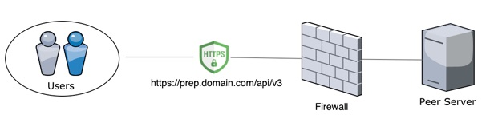
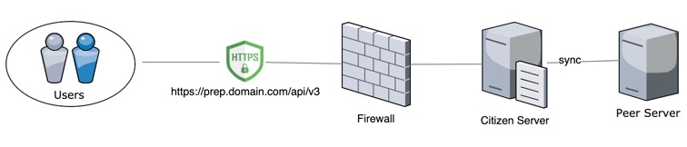
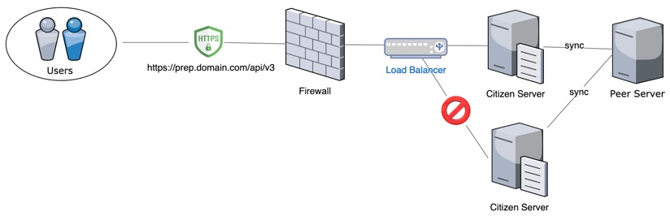
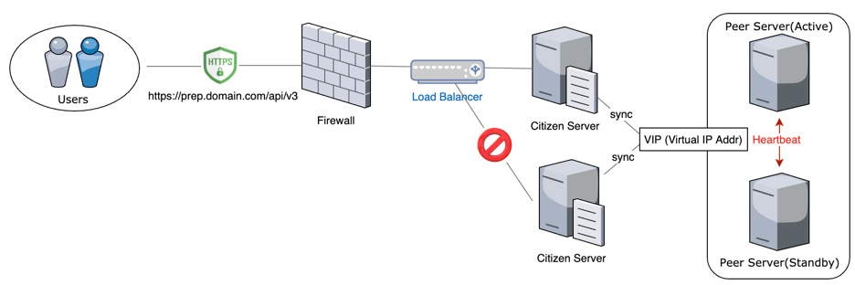

This document is a guideline detailing how to setup network infrastructure on the MainNet.

## Intended Audience
We recommend all P-Rep candidates to go through this guideline.

## Pre-requisites
We assume that you have previous knowledge and experience in:
- IT infrastructure management
- Linux or UNIX system administration
- Network administration
- Linux server and docker service troubleshooting
- Docker container

## How to setup network infrastructure

An administrator can set up various networks in order to secure network availability and security.
In order to provide Endpoint service through RPC(900 port) we recommend using Reserve Proxy.
In addition, by operating a Citizen Node, it can prevent an overload problem.
 

### Endpoint Network Model

In order to operate Endpoint, we recommend using Firewall, Reverse Proxy and SSL certificate. 

1. Single P-Rep  ( Security ★ , Availability ★)
 

2. Single P-Rep/Single Citizen (Security ★★, Availability ★★)
  
	- Using Citizen Node, P-Reps can protect its network and prevent overload problems.

3. Single P-Rep/Multiple Citizen (Security ★★★, Availability ★★★)
 
	- Using LoadBalancer, P-Reps can prevent any network errors and distribute overload problems.

4. Multiple P-Rep/Multiple Citizen (Security ★★★, Availability ★★★★)
 
	- Using LoadBalancer, P-Reps can prevent any network failures and distribute overloaded data 

	- P-Reps can be operated by setting Active or Standby status, 

#### How to Secure Your P-Rep node 
P-Rep node operator should have methods to enhance security. 
Setting throttle by using Nginx as Reserve Proxy, P-Reps can protect its network from DDoS attack and able to build a White IP list based network. 

Refer to the link below
- [How to use nginx to prevent DDoS attacks](./how_to_using_nginx_to_prevent_DDoS_attacks.md)

#### Network design for high availability
P-Rep node operators should have methods to enhance the availability of the network. 
By setting Active or Backup in PaceMaker, P-Reps can enhance the availability of the network.

Refer to the link below
- [How to design a highly available network infrastructure](./how_to_network_design_for_high_availability.md)

