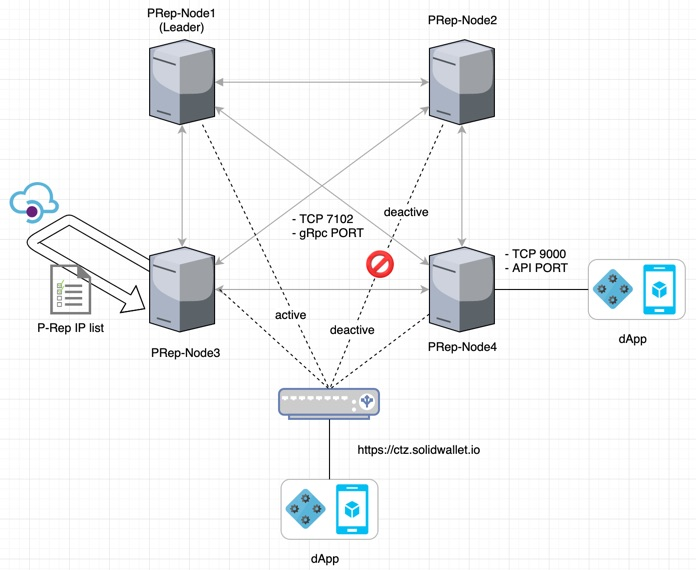

This document is a guideline detailing how to install and operate a Public Representative (“P-Rep”) node on the MainNet using a docker. 
P-Reps are the consensus nodes that produce, verify blocks and participate in network policy decisions on the ICON Network. 


## Intended Audience

We recommend all P-Rep candidates to go through this guideline.


## Pre-requisites

We assume that you have previous knowledge and experience in:

- IT infrastructure management
- Linux or UNIX system administration
- Docker container
- Linux server and docker service troubleshooting

### HW Requirements for MainNet
Below specification is a minimum requirement .
 
| Description | Minimum Specifications|  Recommended Specifications|
|-----|-----|-----|
|CPU model|Intel(R) Xeon(R) CPU @ 3.00GHz|Intel(R) Xeon(R) CPU @ 3.00GHz|
|vCPU (core) |16|36|
|RAM|32G|72G|
|Disk|200G |500G |
|Network|1Gbps|1Gbps|


### SW Requirements

#### OS requirements

- Linux (CentOS 7 or Ubuntu 16.04+)

#### Package requirements

- Docker 18.x or higher

For your reference, ICON node depends on the following packages. The packages are included in the P-Rep docker image that we provide, so you don't need to install them separately. 

- Python 3.6.5+ or 3.7.x.
- RabbitMQ 3.7 or higher


## Network Diagram of P-Rep nodes



Above diagram shows how P-Rep nodes are interacting with each other in the test environment. 

- Endpoint: https://ctz.solidwallet.io

  - Endpoint is the load balancer that accepts the transaction requests from DApps and relays the requests to an available P-Rep node. <br>
  In the test environment, ICON foundation is running the endpoint. It is also possible for each P-Rep to set up their own endpoint to directly serve DApps (as depicted in PRep-Node4), but that configuration is out of the scope of this document. 
- Tracker: https://tracker.icon.foundation

  - A block and transaction explorer attached to the MainNet network.
- IP List: https://download.solidwallet.io/conf/prep_iplist.json

  - ICON foundation will maintain the IP list of P-Reps. The JSON file will contain the list of IPs. You should configure your firewalls to allow in/outbound traffic from/to the IP addresses.  Following TCP ports should be open.
  - Port 7100: Used by gRPC for peer to peer communication between nodes.
  - Port 9000: Used by  JSON-RPC API server.
  - The IP whitelist will be automatically updated on a daily basis from the endpoint of the seed node inside the P-Rep Node Docker.

If you need more detailed information, Refer to the link below
- [how-to-setup-network-infrastructure](./how-to-setup-network-infrastructure.md)


## Inside a P-Rep Node

**A process view of a P-Rep node**  

There are five processes, `iconrpcserver`, `iconservice`, `loopchain`, `loop-queue`, and `loop-logger`. 


- iconrpcserver

  - `iconrpcserver` handles JSON-RPC message requests
  - ICON RPC Server receives request messages from external clients and sends responses. When receiving a message, ICON RPC Server identifies the method that the request wants to invoke and transfers it to an appropriate component, either loopchain or ICON Service. 

- iconservice

  - ICON Service manages the state of ICON network (i.e., states of user accounts and SCOREs) using LevelDB.
- Before processing transactions, ICON Service performs the syntax check on the request messages and pre-validates the status of accounts to see if the transactions can be executable.
  
- loopchain

  - `loopchain` is the high-performance Blockchain Consensus & Network engine of ICON.

- loop-queue (RabbitMQ)
  - RabbitMQ is the most widely deployed open source
e message broker. 
  - loopchain uses RabbitMQ as a message queue for inter-process communication. 

- loop-logger (Fluentd)

  - Fluentd is the open source data collector, which lets you unify the data collection and consumption.
  - Fluentd is included in the P-Rep node image. You can use Fluㅡ
                                                                                                                                                                                                                                                                                                                                                                                                                                                                                                                                                                                                                                                                                                                                                                                                                                                                                                                                                                                                                                                                                                                                                                                                                                                                                                                                                                                                                                                                                                                                                                                                                                                                                                                                                                                                                                                                                                                                                                                                                                                                                                                                                                                                                                                                                                                                                                                                                                                                                                                                                                                                                                                                                                                                                                                                                                                                                                                                                                                                                                                                                                                                                                                                                                                                                                                                                                                                                                                                                                                                                                                                                                                                                                                                                                                                                                                                                                                                                                                                                                                                                                                                                                                                                                                                                                                                                                                                                                                                                                                                                                                                                                                                                                                                                                                                                                                                                                                                                                                                                                                                                                                                                                                                                                                                                                                                                                                                                                                                                                                                                                                                                                                                                                                                                                                                                                                                                                                                                                                                                                                                                                                                                                                                                                                                                                                                                                                                                                                                                                                                                                                                                                                                                                                                                                                                                                                                                                                                                                                                                                                                                                                                                                                                                                                                                                                                                                                                                                                                                                                                                                                                                                                                               ntd to systematically collect and aggregate the log data that other processes produce. 


**Which ports a P-Rep Node is using?**

For external communication:

- TCP 7100: gRPC port used for peer-to-peer connection between peer nodes.
- TCP 9000: JSON-RPC or RESTful API port serving application requests.

For internal communication:

- TCP 5672: RabbitMQ port for inter-process communication.

For RabbitMQ management console:

- TCP 15672: RabbitMQ Management will listen on port 15672. 
  - You can use RabbitMQ Management by enabling this port. It must be enabled before it is used.
  - You can access the management web console at `http://{node-hostname}:15672/`


## P-Rep Installation using Docker

Please read the SW requirements above. Below, we will outline the steps for docker installation. 

If you already have installed docker and docker compose, you can skip the part below, and directly go to the [Running P-Rep Node on Docker Container](#running-p-rep-node-on-docker-container)

### Prerequisites - Docker & Docker Compose Installation

If you don't already have docker installed, you can download it here: <https://www.docker.com/community-edition>. Installation requires sudo privilege.

#### On Centos 7

**Step 1: Install Docker**

```shell
## Install necessary packages:
$ sudo yum install -y yum-utils device-mapper-persistent-data lvm2

## Configure the docker-ce repo:
$ sudo yum-config-manager --add-repo https://download.docker.com/linux/centos/docker-ce.repo

## Install docker-ce:
$ sudo yum install docker-ce

## Add your user to the docker group with the following command.
$ sudo usermod -aG docker $(whoami)

## Set Docker to start automatically at boot time:
$ sudo systemctl enable docker.service

## Finally, start the Docker service:
$ sudo systemctl start docker.service

## Then we'll verify docker is installed successfully by checking the version:
$ docker version 

```


**Step 2: Install Docker Compose**

```shell
## Install Extra Packages for Linux
$ sudo yum install epel-release

## Install python-pip
$ sudo yum install -y python-pip

## Then install Docker Compose:
$ sudo pip install docker-compose

## You will also need to upgrade your Python packages on CentOS 7 to get docker-compose to run successfully:
$ sudo yum upgrade python*

## To verify the successful Docker Compose installation, run:
$ docker-compose version

```


#### On Ubuntu 16.04+

**Step 1: Install Docker**

```shell
## Update the apt package index:
$ sudo apt-get update

## Install necessary packages:
$ sudo apt-get install  -y systemd apt-transport-https ca-certificates curl gnupg-agent software-properties-common 

## Add Docker's official GPG key:
$ curl -fsSL https://download.docker.com/linux/ubuntu/gpg | sudo apt-key add -

## Add the apt repository
$ add-apt-repository "deb [arch=amd64] https://download.docker.com/linux/ubuntu $(lsb_release -cs) stable"

## Update the apt package index:
$ sudo apt-get update

## Install docker-ce:
$ sudo apt-get -y install docker-ce docker-ce-cli containerd.io

## Add your user to the docker group with the following command.
$ sudo usermod -aG docker $(whoami)

## Set Docker to start automatically at boot time:
$ sudo systemctl enable docker.service

## Finally, start the Docker service:
$ sudo systemctl start docker.service

## Then we'll verify docker is installed successfully by checking the version:
$ docker version

```


**Step 2: Install Docker Compose**

```shell
## Install python-pip
$ sudo apt-get install -y python-pip

## Then install Docker Compose:
$ sudo pip install docker-compose

## To verify the successful Docker Compose installation, run:
$ docker-compose version

```

### Running a P-Rep Node on Docker Container

Once you have docker installed, then proceed through the following steps to install the P-Rep node.

#### Step 1. Pull the docker image

**Pull the latest stable version of an image.**

```shell
$ docker pull iconloop/prep-node:1910211829xc2286d
```


#### Step 2. Run the P-Rep Node as a Docker container

**Using docker command**

```shell
$ docker run -d  -p 9000:9000 -p 7100:7100 -v ${PWD}/data:/data iconloop/prep-node:1910211829xc2286d
```


**Using docker-compose command (Recommended)**

Open `docker-compose.yml` in a text editor and add the following content:

```yml
version: "3"
services:
  prep-node:
     image: "iconloop/prep-node:1910211829xc2286d"
     container_name: "prep-mainnet"
     network_mode: host     
     restart: "always"
     environment:
        NETWORK_ENV: "mainnet"
        LOG_OUTPUT_TYPE: "file"
        SWITCH_BH_VERSION3: "10324749"
        CERT_PATH: "/cert"
        LOOPCHAIN_LOG_LEVEL: "DEBUG"
        ICON_LOG_LEVEL: "DEBUG"        
        FASTEST_START: "yes" # Restore from lastest snapshot DB
        PRIVATE_KEY_FILENAME: "{YOUR_KEYSTORE or YOUR_CERTKEY FILENAME}" # only file name
        PRIVATE_PASSWORD: "{YOUR_KEY_PASSWORD}"
     cap_add:
        - SYS_TIME      
     volumes:
        - ./data:/data # mount a data volumes
        - ./cert:/cert # Automatically generate cert key files here
     ports:
        - 9000:9000
        - 7100:7100
```


**Run docker-compose**

```shell
$ docker-compose up -d
```


Above command options, do the following.

1. Map container ports 7100 and 9000 to the host ports.

2. Mount a volume into the docker container.

   - `-v ${PWD}/data:/data`  sets up a bind mount volume that links the `/data/` directory from inside the P-Rep Node container to the `${PWD}/data` directory on the host machine.

   - `data` folder will have the following directory structure.

```shell
.
|---- data  
|     |---- mainnet   → Default ENV directory  
|          |---- .score_data  
|          |      |-- db      → root directory that SCOREs will be installed
|          |      |-- score   → root directory that the state DB file will be created
|          |---- .storage     → root directory that the block DB will be stored
|          |---- log          → root directory that log files will be stored
```


## P-Rep Node Operation and Configuration

### Start Node

Run docker-compose up.

```shell
$ docker-compose up -d
prep_prep_1 is up-to-date
```


The ``docker ps``  command shows the list of running docker containers. 

```shell
$ docker ps
CONTAINER ID   IMAGE                                                          COMMAND                CREATED              STATUS                          PORTS                                                                 NAMES
0de99e33cdc9     iconloop/prep-node:1910211829xc2286d    "/src/entrypoint.sh"      2 minutes ago        Up 2 minutes(healthy)    0.0.0.0:7100->7100/tcp, 0.0.0.0:9000->9000/tcp prep_prep_1
```

The meaning of each column in the `docker ps` result output is as follows. 

| Column       | Description                                                  |
| :----------- | :----------------------------------------------------------- |
| CONTAINER ID | Container  ID                                                |
| IMAGE        | P-Rep Node's  image name                                     |
| COMMAND      | The script will be executed whenever a P-Rep Node container is run |
| STATUS       | Healthcheck status. One of "starting" , "healthy", "unhealthy" or "none" |
| PORTS        | Exposed ports on the running container                       |
| NAMES        | Container name                                               |


You can read the container booting log from the log folder.

```shell
$ tail -f data/PREP-MainNet/log/booting_20190419.log
[2019-10-23 17:47:05.204] Your IP: xx.xx.xx.xx
[2019-10-23 17:47:05.209] RPC_PORT: 9000 / RPC_WORKER: 3
[2019-10-23 17:47:05.214] DEFAULT_PATH=/data/mainnet in Docker Container
[2019-10-23 17:47:05.219] DEFAULT_LOG_PATH=/data/mainnet/log
[2019-10-23 17:47:05.224] DEFAULT_STORAGE_PATH=/data/mainnet/.storage
[2019-10-23 17:47:05.229] scoreRootPath=/data/mainnet/.score_data/score
[2019-10-23 17:47:05.234] stateDbRootPath=/data/mainnet/.score_data/db
[2019-10-23 17:47:05.239] Time synchronization with NTP / NTP SERVER: time.google.com
[2019-10-23 17:47:12.022] P-REP package version info - _1910211829xc2286d
[2019-10-23 17:47:12.697] iconcommons             1.1.2
                        iconrpcserver           1.4.5
                        iconsdk                 1.2.0
                        iconservice             1.5.15
                        loopchain               2.4.15
```


### Stop Node

```shell
$ docker-compose down

Stopping prep_prep_1 ... done
Removing prep_prep_1 ... done
Removing network prep_default
```


### View Node Status

* Check the current state and information of the prep-node

The current state of the node can be confirmed by `/api/v1/status/peer` and `/api/v1/avail/peer`.
The response data are the same, but HTTP response code is different.


```shell
$ curl localhost:9000/api/v1/status/peer

{
  "made_block_count": 0,
  "leader_made_block_count": 7,
  "status": "Service is online: 0",
  "state": "Watch",
  "service_available": true,
  "peer_type": "0",
  "audience_count": "0",
  "consensus": "siever",
  "peer_id": "hx72bff0f887ef183bde1391dc61375f096e75c74a",
  "block_height": 10106994,
  "round": 0,
  "epoch_height": 10106995,
  "unconfirmed_block_height": -1,
  "total_tx": 72003516,
  "unconfirmed_tx": 0,
  "peer_target": "xxx.xxx.xxx.xxx:7100",
  "leader_complaint": 1,
  "peer_count": 24,
  "leader": "hxc9e36a98a3fca0b636eb822ff5a96db658e4bb88",
  "epoch_leader": "hxc9e36a98a3fca0b636eb822ff5a96db658e4bb88",
  "versions": {
    "loopchain": "2.4.15",
    "iconservice": "1.5.15",
    "iconrpcserver": "1.4.5",
    "iconcommons": "1.1.2",
    "earlgrey": "0.0.4"
  },
  "mq": {
    "peer": {
      "message_count": 0
    },
    "channel": {
      "message_count": 0
    },
    "score": {
      "message_count": 0
    }
  }
}
```


* `/api/v1/avail/peer` returns HTTP response 503 when Service Unavailable  

This is useful when performing a health check based on the HTTP response code of the load balancer.

* `/api/v1/avail/peer` returns HTTP 503 Service Unavailable 

```
#Return HTTP 503 Service Unavailable 

state : InitComponents, EvaluateNetwork, BlockSync, SubscribeNetwork
```
* `/api/v1/status/peer` returns 200 OK at BlockSync

```
$ curl -i localhost:9000/api/v1/status/peer
HTTP/1.1 200 OK
Connection: close
Access-Control-Allow-Origin: *
Content-Length: 573
Content-Type: application/json
 
{
  "made_block_count": 0,
  "leader_made_block_count": 7,
  "status": "Service is online: 0",
  "state": "Watch",
  "service_available": true,
  "peer_type": "0",
  "audience_count": "0",
  "consensus": "siever",
  "peer_id": "hx72bff0f887ef183bde1391dc61375f096e75c74a",
  "block_height": 10106994,
  "round": 0,
  "epoch_height": 10106995,
  "unconfirmed_block_height": -1,
  "total_tx": 72003516,
  "unconfirmed_tx": 0,
  "peer_target": "xxx.xxx.xxx.xxx:7100",
  "leader_complaint": 1,
  "peer_count": 24,
  "leader": "hxc9e36a98a3fca0b636eb822ff5a96db658e4bb88",
  "epoch_leader": "hxc9e36a98a3fca0b636eb822ff5a96db658e4bb88",
  "versions": {
    "loopchain": "2.4.15",
    "iconservice": "1.5.15",
    "iconrpcserver": "1.4.5",
    "iconcommons": "1.1.2",
    "earlgrey": "0.0.4"
  },
  "mq": {
    "peer": {
      "message_count": 0
    },
    "channel": {
      "message_count": 0
    },
    "score": {
      "message_count": 0
    }
  }
}
```
* `/api/v1/avail/peer` returns 503 OK at BlockSync

```
$ curl -i localhost:9000/api/v1/avail/peer
HTTP/1.1 503 Service Unavailable
Connection: close
Access-Control-Allow-Origin: *
Content-Length: 573
Content-Type: application/json
 
{
  "made_block_count": 0,
  "leader_made_block_count": 7,
  "status": "Service is online: 0",
  "state": "Watch",
  "service_available": true,
  "peer_type": "0",
  "audience_count": "0",
  "consensus": "siever",
  "peer_id": "hx72bff0f887ef183bde1391dc61375f096e75c74a",
  "block_height": 10106994,
  "round": 0,
  "epoch_height": 10106995,
  "unconfirmed_block_height": -1,
  "total_tx": 72003516,
  "unconfirmed_tx": 0,
  "peer_target": "xxx.xxx.xxx.xxx:7100",
  "leader_complaint": 1,
  "peer_count": 24,
  "leader": "hxc9e36a98a3fca0b636eb822ff5a96db658e4bb88",
  "epoch_leader": "hxc9e36a98a3fca0b636eb822ff5a96db658e4bb88",
  "versions": {
    "loopchain": "2.4.15",
    "iconservice": "1.5.15",
    "iconrpcserver": "1.4.5",
    "iconcommons": "1.1.2",
    "earlgrey": "0.0.4"
  },
  "mq": {
    "peer": {
      "message_count": 0
    },
    "channel": {
      "message_count": 0
    },
    "score": {
      "message_count": 0
    }
  }
}
```

#### Node Status Detail
|value name|Description | Reason or allowed value|
|------|------|------|
|made_block_count|number of block generated by node| Reset when node became a leader after a rotation or reorerated.|
|status| service on / off status| "Service is online: 1" : Working (leader status) <br> "Service is online: 0" : Working (not a leader status) <br> "Service is offline: block height sync" : block sync condition <br> "Service is offline: mq down" ": channel mq issue|
|state|node condition|detailed information (display at bottom)|
|service_available|service condition| [ true \| false ]|
|peer_type|classify leader node and verifying node| "0" : verifying node <br> "1" : leader node|
|audience_count| `DEPRECATION`, It will be remove||
|consensus | consensus algorithm|  "siever" : current consensus algorithm <br> "LFT" : consensus algorithm that will adapt in the future|
|peer_id| unique address of node|40 digit HEX string|
|block_height|Current block height of node|
|round| number of counts for current block consensus process|| The count increases by one when leader node fails to process transaction and leader complaint is occured or consensus is failed. The count reset when block generation is complete|
|epoch_height|block heights of processing block. In case of citizen nodes, their block heights stop at SubscribeNetwork block heights because they don’t participate in consensus.|
|unconfirmed_block_height| block heights of unprocessed block|	same as epoch_height|
|total_tx| Total number of tx until current block||
| unconfirmed_tx| number of unprocessed tx that hold by queue<br> if it holds by leader more than one minute leader complaint will occur|
|peer_target| IP address and port of node| "IP:PORT"|
|leader_complaint |`DEPRECATION`, It will be remove 	||
|peer_count|total number of nodes in blockchain network||
|leader| Unique address of a leader node| 40 digit HEX string|
|epoch_leader| Unique address of a leader node in consensus process| 40 digit HEX string|
|mq.peer.message_count| Accumulated number of messages in pier MQ| Presents ‘-1’ when an error occurs and details can be found in "error"|
|mq.channel.message_count| Accumulated number of messages in channel MQ| Presents ‘-1’ when an error occurs and details can be found in "error"|
|mq.score.message_count| Accumulated number of messages in SCORE MQ| Presents ‘-1’ when an error occurs and details can be found in "error"|


##### State Detail

|State Value| Description|
|------|-----|
|InitComponents|Channel Service initial state|
|Consensus|Loopchain Consensus begins. Convert to BlockHeightSync automatically|
|BlockHeightSync| Block height Sync state begins. Convert to EvaluateNetwork automatically|
|EvaluateNetwork| Evaluate the BlockSync state by checking the network status|
|BlockSync|Block Sync loop.|
|SubscribeNetwork| Determine the type depending on the node type. A citizen node requests the block generation message to a parent node.|
|Watch|Citizen node default state. Relay transaction and sync the blocks created by a parent node|
|Vote|Status of validating and voting blocks created by the leader|
|LeaderComplain|Status of requesting leader complain for current leader and wait for complain|
|BlockGenerate|Status of leader creating a block|
|GracefulShutdown|End Process|


### Docker Environment Variables

If you want change the TimeZone, open `docker-compose.yml` in a text editor and add the following content:

```yml
version: "3"
services:
  prep-node:
     image: "iconloop/prep-node:1910211829xc2286d"
     container_name: "prep-mainnet"
     network_mode: host     
     restart: "always"
     environment:
        NETWORK_ENV: "mainnet"
        LOG_OUTPUT_TYPE: "file"
        SWITCH_BH_VERSION3: "10324749"
        CERT_PATH: "/cert"
        LOOPCHAIN_LOG_LEVEL: "DEBUG"
        ICON_LOG_LEVEL: "DEBUG"        
        FASTEST_START: "yes" # Restore from lastest snapshot DB
        PRIVATE_KEY_FILENAME: "{YOUR_KEYSTORE or YOUR_CERTKEY FILENAME}" # only file name
        PRIVATE_PASSWORD: "{YOUR_KEY_PASSWORD}"
        TZ: "America/Los_Angeles"
     cap_add:
        - SYS_TIME      
     volumes:
        - ./data:/data # mount a data volumes
        - ./cert:/cert # Automatically generate cert key files here
     ports:
        - 9000:9000
        - 7100:7100
```


The P-Rep Node image supports the following environment variables:

| Environment variable | Description|Default value| Allowed value|
|--------|--------|-------|-------|
| IPADDR| Setting the IP address|$EXT\_IPADDR||
| LOCAL\_TEST|false|false||
| TZ| Setting the TimeZone Environment|Asia/Seoul|[List of TZ name](https://en.wikipedia.org/wiki/List\_of\_tz\_database\_time\_zones)|
| NETWORK\_ENV|PREP|PREP||
| SERVICE| Service Name|default||
| SERVICE\_API| SERVICE\_API URI|https://${SERVICE}.net.solidwallet.io/api/v3|URI|
| ENDPOINT\_URL|  ENDPOINT API URI|https://${SERVICE}.net.solidwallet.io|URI|
| NTP\_SERVER| NTP SERVER ADDRESS|time.google.com||
| NTP\_REFRESH\_TIME| NTP refresh time|21600||
| FIND\_NEIGHBOR| Find fastest neighborhood PRrep|false||
| DEFAULT\_PATH| Setting the Default Root PATH|/data/${NETWORK\_ENV}||
| DEFAULT\_LOG\_PATH| Setting the logging path|${DEFAULT\_PATH}/log||
| DEFAULT\_STORAGE\_PATH| block DB will be stored|${DEFAULT\_PATH}/.storage||
| USE\_NAT| if you want to use NAT Network|no||
| NETWORK\_NAME||||
| VIEW\_CONFIG| for check deployment state|false| boolean (true/false)|
| USE\_MQ\_ADMIN| Enable RabbitMQ management Web interface.The management UI can be accessed using a Web browser at http://{node|false||
| MQ\_ADMIN| RabbitMQ management username|admin||
| MQ\_PASSWORD| RabbitMQ management password|iamicon||
| LOOPCHAIN\_LOG\_LEVEL| loopchain log level|INFO||
| ICON\_LOG\_LEVEL| iconservice log level|INFO||
| LOG\_OUTPUT\_TYPE| loopchain's output log type|file| file, console, file\|console|
| outputType|iconservice's output log type|$LOG\_OUTPUT\_TYPE| file, console, file\|console|
| CONF\_PATH| Setting the configure file path|/${APP\_DIR}/conf||
| CERT\_PATH| Setting the certificate key file path|/${APP\_DIR}/cert||
| REDIRECT\_PROTOCOL|http|http||
| SUBSCRIBE\_USE\_HTTPS|false|false||
| ICON\_NID| Setting the ICON Network ID number|0x50||
| ALLOW\_MAKE\_EMPTY\_BLOCK|false|false||
| score\_fee|true|true||
| score\_audit|false|false||
| scoreRootPath|${DEFAULT\_PATH}/.score\_data/score|${DEFAULT\_PATH}/.score\_data/score||
| stateDbRootPath|${DEFAULT\_PATH}/.score\_data/db|${DEFAULT\_PATH}/.score\_data/db||
| iissDbRootPath|${DEFAULT\_PATH}/.iissDb|${DEFAULT\_PATH}/.iissDb||
| CHANNEL\_BUILTIN| boolean (true/false)|true||
| PEER\_NAME|`uname`|`uname`||
| PUBLIC\_PATH| public cert key location|${CERT\_PATH}/${IPADDR}\_public.der||
| PRIVATE\_PATH| private cert key location|${CERT\_PATH}/${IPADDR}\_private.der||
| PRIVATE\_PASSWORD| private cert key password|test||
| LOAD\_PEERS\_FROM\_IISS|true|true||
| CHANNEL\_MANAGE\_DATA\_PATH|${CONF\_PATH}/channel\_manange\_data.json|${CONF\_PATH}/channel\_manange\_data.json||
| CONFIG\_API\_SERVER|https://download.solidwallet.io|https://download.solidwallet.io||
| GENESIS\_DATA\_PATH|${CONF\_PATH}/genesis.json|${CONF\_PATH}/genesis.json||
| BLOCK\_VERSIONS||||
| NEXT\_BLOCK\_VERSION\_HEIGHT||||
| FORCE\_RUN\_MODE| Setting the loopchain running parameter e.g. if FORCE\_RUN\_MODE is |||
| configure\_json|${CONF\_PATH}/configure.json|${CONF\_PATH}/configure.json||
| iconservice\_json|${CONF\_PATH}/iconservice.json|${CONF\_PATH}/iconservice.json||
| iconrpcserver\_json|${CONF\_PATH}/iconrpcserver.json|${CONF\_PATH}/iconrpcserver.json||
| ICON\_REVISION|4|4||
| ROLE\_SWITCH\_BLOCK\_HEIGHT|1|1||
| mainPRepCount|22|22||
| mainAndSubPRepCount|100|100||
| decentralizeTrigger|0.002|0.002||
| RPC\_PORT| Choose a RPC service port|9000||
| RPC\_WORKER|Setting the number of RPC workers|3||
| RPC\_GRACEFUL\_TIMEOUT| rpc graceful timeout|0||


## Troubleshooting

### Q: How to check if container is running or not

The ``docker ps``  command shows the list of running docker containers. 

```shell
$ docker ps
CONTAINER ID   IMAGE                                                          COMMAND                CREATED              STATUS                          PORTS                                                                 NAMES
0de99e33cdc9     iconloop/prep-node:1910211829xc2286d    "/src/entrypoint.sh"      2 minutes ago        Up 2 minutes(healthy)    0.0.0.0:7100->7100/tcp, 0.0.0.0:9000->9000/tcp prep_prep_1
```

You should look at the `STATUS` field to see if the container is running up and in `healthy` state. 

Inside the container, there is a `healthcheck` script running with the following configuration. It will return `unhealthy` when it fails. 

| Healthcheck option | value |
| :----------------- | :---- |
| retries            | 4     |
| interval           | 30s   |
| timeout            | 20s   |
| start-period       | 60s   |

The container can have three states:

- starting - container just starts
- healthy - when the health check passes
- unhealthy - when the health check fails


If the container does not start properly or went down unexpectedly, please check the `booting.log`. Below is the log messages on **success**. 

```shell
$ cat data/PREP-MainNet/log/booting_${DATE}.log 

[2019-10-23 17:47:05.204] Your IP: xxx.xxx.xxx.xxx
[2019-10-23 17:47:05.209] RPC_PORT: 9000 / RPC_WORKER: 3
[2019-10-23 17:47:05.214] DEFAULT_PATH=/data/mainnet in Docker Container
[2019-10-23 17:47:05.219] DEFAULT_LOG_PATH=/data/mainnet/log
[2019-10-23 17:47:05.224] DEFAULT_STORAGE_PATH=/data/mainnet/.storage
[2019-10-23 17:47:05.229] scoreRootPath=/data/mainnet/.score_data/score
[2019-10-23 17:47:05.234] stateDbRootPath=/data/mainnet/.score_data/db
[2019-10-23 17:47:05.239] Time synchronization with NTP / NTP SERVER: time.google.com
[2019-10-23 17:47:12.022] P-REP package version info - _1910211829xc2286d
[2019-10-23 17:47:12.697] iconcommons             1.1.2
iconrpcserver           1.4.5
iconsdk                 1.2.0
iconservice             1.5.15
loopchain               2.4.15

```


### Q: How to find error

**Error log messages example**

Grep the `ERROR` messages from the log files to find the possible cause of the failure.

```shell
$ cat data/PREP-MainNet/log/booting_${DATE}.log | grep ERROR

[2019-08-12 02:08:48.746] [ERROR] Download Failed - http://20.20.1.149:5000/cert/20.20.1.195_public.der status_code=000

[2019-08-12 01:58:46.439] [ERROR] Unauthorized IP address, Please contact our support team
```


**Docker container generates below log files**

- booting.log
  - The log file contains the errors that occurred when the docker container starts up.
- iconrpcserver.log
  - The log file contains information about the request/response message handling going through the iconrpcserver. 
- iconservice.log
  - The log file contains the internals of ICON Service
- loopchain.channel-txcreator-icon_dex_broadcast.icon_dex.log
  - The log file contains information about TX broadcast from a node to other nodes
- loopchain.channel-txcreator.icon_dex.log
  - The log file contains information about the process of confirming TXƒ
- loopchain.channel-txreceiver.icon_dex.log
  - The log file contains information about receiving the broadcasted TX from a node.
- loopchain.channel.icon_dex.log
  - The log file contains information about internals of loopchain engine


### Q: How to monitor **resources**

We recommend the following tools for resource monitoring

1. Network monitoring - iftop, nethogs, vnstat
2. CPU/Memory monitoring - top, htop
3. Disk I/O monitoring - iostat, iotop
4. Docker monitoring - docker stats, ctop


