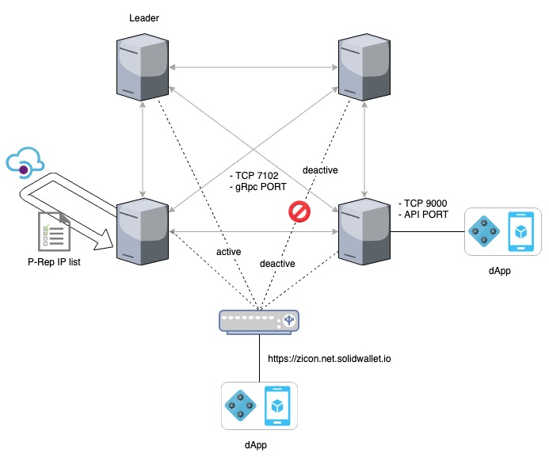

This document is a guideline about how to install and operate a Public Representative (“P-Rep”) node on the Testnet using a docker. P-Reps are the consensus nodes that produce, verify blocks and participate in network policy decisions on the ICON Network. The purpose of the Testnet is to provide a test environment for the P-Rep candidates. The Candidates can simulate various activities such as block production to check technical stability of the nodes on the Testnet. (The node operation guideline on the ICON Mainnet for the elected P-Reps will be released in the future.)


## Intended Audience

We recommend all P-Rep candidates to go through this guideline and participate in the block generation test.


## Pre-requisites

We assume that you have previous knowledge and experience in:

- IT infrastructure management
- Linux or UNIX system administration
- Docker container
- Linux server and docker service troubleshooting

### HW Requirements for Testnet

Below specification is a minimum requirement for the testnet application. 

| Description | Minimum Specifications|  Recommended Specifications|
|-----|-----|-----|
|CPU model|Intel(R) Xeon(R) CPU @ 3.00GHz|Intel(R) Xeon(R) CPU @ 3.00GHz|
|vCPU (core) |16|36|
|RAM|32G|72G|
|Disk|200G |500G |
|Network|1Gbps|1Gbps|


### SW Requirements

#### OS requirements

- Linux (CentOS 7 or Ubuntu 16.04+)

#### Package requirements

- Docker 18.x or higher

For your reference, ICON node depends on the following packages. The packages are included in the P-Rep docker image that we provide, so you don't need to install them separately. 

- Python 3.6.5 or higher
- RabbitMQ 3.7 or higher


## Network Diagram of P-Rep nodes



Above diagram shows how P-Rep nodes are interacting with each other in the test environment. 


- Endpoint: https://zicon.net.solidwallet.io

  - Endpoint is the load balancer that accepts the transaction requests from DApps and relays the requests to an available P-Rep node. In the test environment, ICON foundation is running the endpoint. It is also possible for each P-Rep to setup own endpoint to directly serve DApps (as depicted in PRep-Node4), but that configuration is out of the scope of this document. 
- Tracker: https://zicon.tracker.solidwallet.io

  - A block and transaction explorer attached to the test network.

- Firewall
  - Port 7100: Used by gRPC for peer to peer communication between nodes. (We recommend any open)
  - Port 9000: Used by JSON-RPC API server.  (We recommend any open)


## Inside a P-Rep Node

**A process view of a P-Rep node**  

There are five processes, `iconrpcserver`, `iconservice`, `loopchain`, `loop-queue`, and `loop-logger`. 


- iconrpcserver

  - `iconrpcserver` handles JSON-RPC message requests
  - ICON RPC Server receives request messages from external clients and sends responses. When receiving a message, ICON RPC Server identifies the method that the request wants to invoke and transfers it to an appropriate component, either loopchain or ICON Service. 

- iconservice

  - ICON Service manages the state of ICON network (i.e., states of user accounts and SCOREs) using LevelDB.
- Before processing transactions, ICON Service performs the syntax check on the request messages and prevalidates the status of accounts to see if the transactions can be executable.
  
- loopchain

  - `loopchain` is the high-performance Blockchain Consensus & Network engine of ICON.

- loop-queue (RabbitMQ)

  - RabbitMQ is the most widely deployed open source message broker. 
  - loopchain uses RabbitMQ as a message queue for inter-process communication. 

- loop-logger (Fluentd)

  - Fluentd is the open source data collector, which lets you unify the data collection and consumption.
  - Fluentd is included in the P-Rep node image. You can use Fluentd to systemically collect and aggregate the log data that other processes produce. 


**Which ports a P-Rep Node is using?**

For external communication:

- TCP 7100: gRPC port used for peer-to-peer connection between peer nodes.
- TCP 9000: JSON-RPC or RESTful API port serving application requests.

For internal communication:

- TCP 5672: RabbitMQ port for inter-process communication.

For RabbitMQ management console:

- TCP 15672: RabbitMQ Management will listen on port 15672. 
  - You can use RabbitMQ Management by enabling this port. It must be enabled before it is used.
  - You can access the management web console at `http://{node-hostname}:15672/`


## P-Rep Installation using Docker

Please read the SW requirements above. In this chapter, we start by going through the docker installation. 

If you already have installed docker and docker compose, you can skip the part below, and directly go to the [Running P-Rep Node on Docker Container](#running-p-rep-node-on-docker-container)

### Prerequisites - Docker & Docker Compose Installation

If you don't already have docker installed, you can download it here: <https://www.docker.com/community-edition>. Installation requires sudo privilege.

#### On Centos 7

**Step 1: Install Docker**

```shell
## Install necessary packages:
$ sudo yum install -y yum-utils device-mapper-persistent-data lvm2

## Configure the docker-ce repo:
$ sudo yum-config-manager --add-repo https://download.docker.com/linux/centos/docker-ce.repo

## Install docker-ce:
$ sudo yum install docker-ce

## Add your user to the docker group with the following command.
$ sudo usermod -aG docker $(whoami)

## Set Docker to start automatically at boot time:
$ sudo systemctl enable docker.service

## Finally, start the Docker service:
$ sudo systemctl start docker.service

## Then we'll verify docker is installed successfully by checking the version:
$ docker version 

```


**Step 2: Install Docker Compose**

```shell
## Install Extra Packages for Linux
$ sudo yum install epel-release

## Install python-pip
$ sudo yum install -y python-pip

## Then install Docker Compose:
$ sudo pip install docker-compose

## You will also need to upgrade your Python packages on CentOS 7 to get docker-compose to run successfully:
$ sudo yum upgrade python*

## To verify the successful Docker Compose installation, run:
$ docker-compose version

```


#### On Ubuntu 16.04+

**Step 1: Install Docker**

```shell
## Update the apt package index:
$ sudo apt-get update

## Install necessary packages:
$ sudo apt-get install  -y systemd apt-transport-https ca-certificates curl gnupg-agent software-properties-common 

## Add Docker's official GPG key:
$ curl -fsSL https://download.docker.com/linux/ubuntu/gpg | sudo apt-key add -

## Add the apt repository
$ add-apt-repository "deb [arch=amd64] https://download.docker.com/linux/ubuntu $(lsb_release -cs) stable"

## Update the apt package index:
$ sudo apt-get update

## Install docker-ce:
$ sudo apt-get -y install docker-ce docker-ce-cli containerd.io

## Add your user to the docker group with the following command.
$ sudo usermod -aG docker $(whoami)

## Set Docker to start automatically at boot time:
$ sudo systemctl enable docker.service

## Finally, start the Docker service:
$ sudo systemctl start docker.service

## Then we'll verify docker is installed successfully by checking the version:
$ docker version

```


**Step 2: Install Docker Compose**

```shell
## Install python-pip
$ sudo apt-get install -y python-pip

## Then install Docker Compose:
$ sudo pip install docker-compose

## To verify the successful Docker Compose installation, run:
$ docker-compose version

```


### Running a P-Rep Node on Docker Container

You have docker installed, then proceed the following steps to install the P-Rep node.

#### Step 1. Pull the docker image

**Pull the latest stable version of an image.**

```shell
$ docker pull iconloop/prep-node:1909111919x74b59c
```


#### Step 2. Run the P-Rep Node as a Docker container

**Using docker command**

```shell
$ docker run -d  -p 9000:9000 -p 7100:7100 -v ${PWD}/data:/data iconloop/prep-node:1909111919x74b59c
```


**Using docker-compose command (Recommended)**

Open `docker-compose.yml` in a text editor and add the following content:

```yml
version: '3'
services:
   prep:
      image: iconloop/prep-node:1909180304x565582
      container_name: "prep-node"
      network_mode: host
      restart: always
      environment:
         LOOPCHAIN_LOG_LEVEL: "DEBUG"
         ICON_LOG_LEVEL: "DEBUG"
         DEFAULT_PATH: "/data/loopchain"
         LOG_OUTPUT_TYPE: "file"
         CERT_PATH: "/cert"     
         iissCalculatePeriod: "1800"
         termPeriod: "1800"
         PRIVATE_PATH: "/cert/{==YOUR_KEYSTORE or YOUR_CERTKEY FILENAME==}"
         PRIVATE_PASSWORD: "{==YOUR_KEY_PASSWORD==}"
      cap_add:
         - SYS_TIME
      volumes:
         - ./data:/data
         - ./cert:/cert  
      ports:
         - 9000:9000
         - 7100:7100

```


**Run docker-compose**

```shell
$ docker-compose up -d
```


Above command options do the followings.

1. Map container ports 7100 and 9000 to the host ports.

2. Mount a volume into the docker container.

   - `-v ${PWD}/data:/data`  sets up a bind mount volume that links the `/data/` directory from inside the P-Rep Node container to the `${PWD}/data` directory on the host machine.

   - `data` folder will have the following directory structure.

```shell
.
|---- data  
|     |---- PREP-TestNet   → Default ENV directory  
|          |---- .score_data  
|          |      |-- db      → root directory that SCOREs will be installed
|          |      |-- score   → root directory that the state DB file will be created
|          |---- .storage     → root directory that the block DB will be stored
|          |---- log          → root directory that log files will be stored
```


## P-Rep Node Operation and Configuration

### Start Node

Run docker-compose up.

```shell
$ docker-compose up -d
prep_prep_1 is up-to-date
```


The ``docker ps``  command shows the list of running docker containers. 

```shell
$ docker ps
CONTAINER ID   IMAGE                                                          COMMAND                CREATED              STATUS                          PORTS                                                                 NAMES
0de99e33cdc9     iconloop/prep-node:1909180304x565582    "/src/entrypoint.sh"      2 minutes ago        Up 2 minutes(healthy)    0.0.0.0:7100->7100/tcp, 0.0.0.0:9000->9000/tcp prep_prep_1
```

The meaning of each column in the `docker ps` result output is as follows. 

| Column       | Description                                                  |
| :----------- | :----------------------------------------------------------- |
| CONTAINER ID | Container  ID                                                |
| IMAGE        | P-Rep Node's  image name                                     |
| COMMAND      | The script will be executed whenever a P-Rep Node container is run |
| STATUS       | Healthcheck status. One of "starting" , "healthy", "unhealthy" or "none" |
| PORTS        | Exposed ports on the running container                       |
| NAMES        | Container name                                               |


You can read the container booting log from the log folder.

```shell
$ tail -f data/PREP-TestNet/log/booting_20190419.log
[2019-09-10 02:19:01.454] DEFAULT_STORAGE_PATH=/data/PREP-TestNet/.storage
[2019-09-10 02:19:01.459] scoreRootPath=/data/PREP-TestNet/.score_data/score
[2019-09-10 02:19:01.464] stateDbRootPath=/data/PREP-TestNet/.score_data/db
[2019-09-10 02:19:01.468] P-REP package version info - 1909180304x565582
[2019-09-10 02:19:02.125] iconcommons             1.1.2
                          iconrpcserver           1.4.3
                          iconsdk                 1.1.0
                          iconservice             1.5.5
                          loopchain               2.3.7
[2019-09-10 02:19:07.107] Enable rabbitmq_management
[2019-09-10 02:19:10.676] Network: PREP-TestNet
[2019-09-10 02:19:10.682] Run loop-peer and loop-channel start
[2019-09-10 02:19:10.687] Run iconservice start!
[2019-09-10 02:19:10.692] Run iconrpcserver start!
```


### Stop Node

```shell
$ docker-compose down

Stopping prep_prep_1 ... done
Removing prep_prep_1 ... done
Removing network prep_default
```


### View Node Status

```shell
$ curl localhost:9000/api/v1/status/peer

{
  "made_block_count": 10,
  "leader_made_block_count": 10,
  "status": "Service is online: 1",
  "state": "BlockGenerate",
  "service_available": true,
  "peer_type": "1",
  "audience_count": "0",
  "consensus": "siever",
  "peer_id": "hx6834efa18f6abe7d99de79e9bc9116f82e155620",
  "block_height": 17034,
  "round": 0,
  "epoch_height": 17035,
  "unconfirmed_block_height": 17035,
  "total_tx": 17691,
  "unconfirmed_tx": 1,
  "peer_target": "20.20.1.212:7100",
  "leader_complaint": 1,
  "peer_count": 5,
  "leader": "hx6834efa18f6abe7d99de79e9bc9116f82e155620",
  "epoch_leader": "hx6834efa18f6abe7d99de79e9bc9116f82e155620",
  "versions": {
    "loopchain": "2.3.7",
    "iconservice": "1.5.5",
    "iconrpcserver": "1.4.3",
    "iconcommons": "1.1.2",
    "earlgrey": "0.0.4"
  },
  "mq": {
    "peer": {
      "message_count": 0
    },
    "channel": {
      "message_count": 0
    },
    "score": {
      "message_count": 0
    }
  }
}
```


### Docker Environment Variables

If you want change the TimeZone, open `docker-compose.yml` in a text editor and add the following content:

```yml
version: '3' services:    container:        image: 'iconloop/prep-node:1909180304x565582'        container_name: 'prep-node'        volumes:            - ./data:/data        ports:           - 9000:9000           - 7100:7100       environment:          TZ: "America/Los_Angeles"
```


The P-Rep Node image supports the following environment variables:

| Environment variable | Description|Default value| Allowed value|
|--------|--------|-------|-------|
| IPADDR| Setting the IP address|$EXT\_IPADDR||
| TZ| Setting the TimeZone Environment|Asia/Seoul|[List of TZ name](https://en.wikipedia.org/wiki/List\_of\_tz\_database\_time\_zones)|
| NETWORK\_ENV| Network Environment name|PREP-TestNet||
| SERVICE| Service Name|zicon||
| ENDPOINT\_URL|  ENDPOINT API URI|https://${SERVICE}.net.solidwallet.io|URI|
| SERVICE\_API| SERVICE\_API URI|${ENDPOINT\_URL}/api/v3|URI|
| NTP\_SERVER| NTP SERVER ADDRESS|time.google.com||
| NTP\_REFRESH\_TIME| NTP refresh time|21600||
| FIND\_NEIGHBOR| Find fastest neighborhood PRrep|true||
| GENESIS\_NODE|false|false||
| DEFAULT\_PATH| Setting the Default Root PATH|/data/${NETWORK\_ENV}||
| DEFAULT\_LOG\_PATH| Setting the logging path|${DEFAULT\_PATH}/log||
| DEFAULT\_STORAGE\_PATH| block DB will be stored|${DEFAULT\_PATH}/.storage||
| USE\_NAT| if you want to use NAT Network|no||
| NETWORK\_NAME||||
| VIEW\_CONFIG| for check deployment state|false| boolean (true/false)|
| AMQP\_TARGET|127.0.0.1|127.0.0.1||
| USE\_MQ\_ADMIN| Enable RabbitMQ management Web interface.The management UI can be accessed using a Web browser at http://{node-hostname}:15672/. For example, for a node running on a machine with the hostname of prep-node, it can be accessed at http://prepnode:15672/|false| boolean (true/false)|
| MQ\_ADMIN| RabbitMQ management username|admin||
| MQ\_PASSWORD| RabbitMQ management password|iamicon||
| LOOPCHAIN\_LOG\_LEVEL| loopchain log level|INFO| DEBUG, INFO, WARNING, ERROR|
| ICON\_LOG\_LEVEL| iconservice log level|INFO| DEBUG, INFO, WARNING, ERROR|
| LOG\_OUTPUT\_TYPE| loopchain's output log type|file| file, console, file\|console|
| outputType|iconservice's output log type|$LOG\_OUTPUT\_TYPE| file, console, file\|console|
| FIRST\_PEER| for testnet|false||
| NEWRELIC\_LICENSE| for testnet|||
| CONF\_PATH| Setting the configure file path|/${APP\_DIR}/conf||
| CERT\_PATH| Setting the certificate key file path|/${APP\_DIR}/cert||
| REDIRECT\_PROTOCOL|http|http||
| SUBSCRIBE\_USE\_HTTPS|false|false||
| ICON\_NID| Setting the ICON Network ID number|0x50||
| ALLOW\_MAKE\_EMPTY\_BLOCK|true|true||
| score\_fee|true|true||
| score\_audit|false|false||
| scoreRootPath|${DEFAULT\_PATH}/.score\_data/score|${DEFAULT\_PATH}/.score\_data/score||
| stateDbRootPath|${DEFAULT\_PATH}/.score\_data/db|${DEFAULT\_PATH}/.score\_data/db||
| iissDbRootPath|${DEFAULT\_PATH}/.iissDb|${DEFAULT\_PATH}/.iissDb||
| CHANNEL\_BUILTIN| boolean (true/false)|true||
| PEER\_NAME|`uname`|`uname`||
| PRIVATE\_PATH| private cert key or keystore file location|${CERT\_PATH}/${IPADDR}\_private.der||
| PRIVATE\_PASSWORD| private cert key  or keystore file password|test||
| LOAD\_PEERS\_FROM\_IISS|true|true||
| CHANNEL\_MANAGE\_DATA\_PATH|${CONF\_PATH}/channel\_manange\_data.json|${CONF\_PATH}/channel\_manange\_data.json||
| CONFIG\_API\_SERVER|https://download.solidwallet.io|https://download.solidwallet.io||
| GENESIS\_DATA\_PATH|${CONF\_PATH}/genesis.json|${CONF\_PATH}/genesis.json||
| BLOCK\_VERSIONS||||
| NEXT\_BLOCK\_VERSION\_HEIGHT||||
| FORCE\_RUN\_MODE| Setting the loopchain running parameter e.g. if FORCE\_RUN\_MODE is `-r citizen` then loop `-r citizen`|||
| configure\_json|${CONF\_PATH}/configure.json|${CONF\_PATH}/configure.json||
| iconservice\_json|${CONF\_PATH}/iconservice.json|${CONF\_PATH}/iconservice.json||
| iconrpcserver\_json|${CONF\_PATH}/iconrpcserver.json|${CONF\_PATH}/iconrpcserver.json||
| ICON\_REVISION|5|5||
| ROLE\_SWITCH\_BLOCK\_HEIGHT|1|1||
| mainPRepCount|22|22||
| mainAndSubPRepCount|100|100||
| decentralizeTrigger|0.002|0.002||
| iissCalculatePeriod| origin value is 43200|1800||
| termPeriod| origin value is 43120|1800||
| blockValidationPenaltyThreshold|66000000|66000000||
| lowProductivityPenaltyThreshold|85|85||
| RPC\_PORT| Choose a RPC service port|9000||
| RPC\_WORKER|Setting the number of RPC workers|3||
| RPC\_GRACEFUL\_TIMEOUT| rpc graceful timeout|0||
| USE\_PROC\_HEALTH\_CHECK|yes|yes||
| USE\_API\_HEALTH\_CHEK|yes|yes||
| USE\_HELL\_CHEK|yes|yes||
| HEALTH\_CHECK\_INTERVAL| Trigger if greater than 1|20||
| ERROR\_LIMIT|3|3||
| HELL\_LIMIT|30|30||
| USE\_SLACK|  if you want to use the slack|no||
| SLACK\_URL|  slack's webhook URL|||
| SLACK\_PREFIX| slack's prefix header message|||
| CURL\_OPTION|default curl options|-s -S --fail --max-time 30||

## Troubleshooting

### Q: How to check if container is running or not

The ``docker ps``  command shows the list of running docker containers. 

```shell
$ docker ps
CONTAINER ID   IMAGE                                                          COMMAND                CREATED              STATUS                          PORTS                                                                 NAMES
0de99e33cdc9     iconloop/prep-node:1909180304x565582    "/src/entrypoint.sh"      2 minutes ago        Up 2 minutes(healthy)    0.0.0.0:7100->7100/tcp, 0.0.0.0:9000->9000/tcp prep_prep_1
```

You should look at the `STATUS` field to see if the container is running up and in `healthy` state. 

Inside the container, there is a `healthcheck` script running with the following configuration. It will return `unhealthy` when fails. 

| Healthcheck option | value |
| :----------------- | :---- |
| retries            | 4     |
| interval           | 30s   |
| timeout            | 20s   |
| start-period       | 60s   |

The container can have three states:

- starting - container just starts
- healthy - when the health check passes
- unhealthy - when the health check fails


If the container does not start properly or went down unexpectedly, please check the `booting.log`. Below is the log messages on **success**. 

```shell
$ cat data/PREP-TestNet/log/booting_${DATE}.log 

[2019-09-10 02:19:01.435] Your IP: 20.20.1.195
[2019-09-10 02:19:01.439] RPC_PORT: 9000 / RPC_WORKER: 3
[2019-09-10 02:19:01.444] DEFAULT_PATH=/data/PREP-TestNet in Docker Container
[2019-09-10 02:19:01.449] DEFAULT_LOG_PATH=/data/PREP-TestNet/log
[2019-09-10 02:19:01.454] DEFAULT_STORAGE_PATH=/data/PREP-TestNet/.storage
[2019-09-10 02:19:01.459] scoreRootPath=/data/PREP-TestNet/.score_data/score
[2019-09-10 02:19:01.464] stateDbRootPath=/data/PREP-TestNet/.score_data/db
[2019-09-10 02:19:01.468] P-REP package version info - 1909180304x565582
[2019-09-10 02:19:02.125] iconcommons             1.1.2
                          iconrpcserver           1.4.3
                          iconsdk                 1.1.0
                          iconservice             1.5.5
                          loopchain               2.3.7
[2019-09-10 02:19:07.107] Enable rabbitmq_management
[2019-09-10 02:19:10.676] Network: PREP-TestNet
[2019-09-10 02:19:10.682] Run loop-peer and loop-channel start
[2019-09-10 02:19:10.687] Run iconservice start!
[2019-09-10 02:19:10.692] Run iconrpcserver start!

```


### Q: How to find error

**Error log messages example**

Grep the `ERROR` messages from the log files to find the possible cause of the failure.

```shell
$ cat data/PREP-TestNet/log/booting_${DATE}.log | grep ERROR

[2019-09-10 02:08:48.746] [ERROR] Download Failed - http://20.20.1.149:5000/cert/20.20.1.195_public.der status_code=000

[2019-09-10 01:58:46.439] [ERROR] Unauthorized IP address, Please contact our support team
```


**Docker container generates below log files**

- booting.log
  - The log file contains the errors that occurred while the docker container starts up.
- iconrpcserver.log
  - The log file contains information about the request/response message handling going through the iconrpcserver. 
- iconservice.log
  - The log file contains the internals of ICON Service
- loopchain.channel-txcreator-icon_dex_broadcast.icon_dex.log
  - The log file contains information about TX broadcast from a node to other nodes
- loopchain.channel-txcreator.icon_dex.log
  - The log file contains information about the process of confirming TX
- loopchain.channel-txreceiver.icon_dex.log
  - The log file contains information about receiving the broadcasted TX from a node.
- loopchain.channel.icon_dex.log
  - The log file contains information about internals of loopchain engine


### Q: How to monitor **resources**

We recommend the following tools for resource monitoring

1. Network monitoring - iftop, nethogs, vnstat
2. CPU/Memory monitoring - top, htop
3. Disk I/O monitoring - iostat, iotop
4. Docker monitoring - docker stats, ctop
