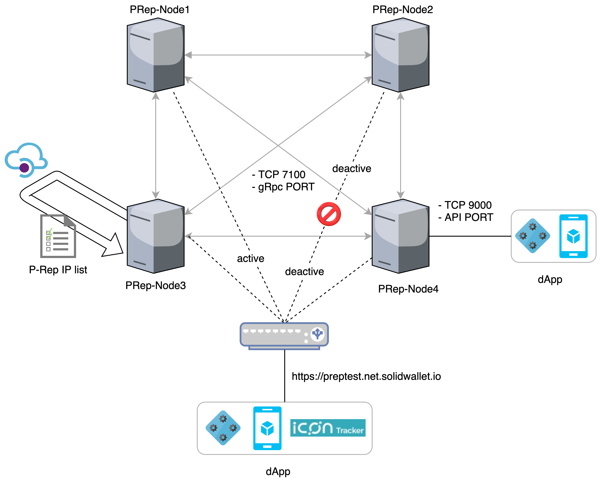
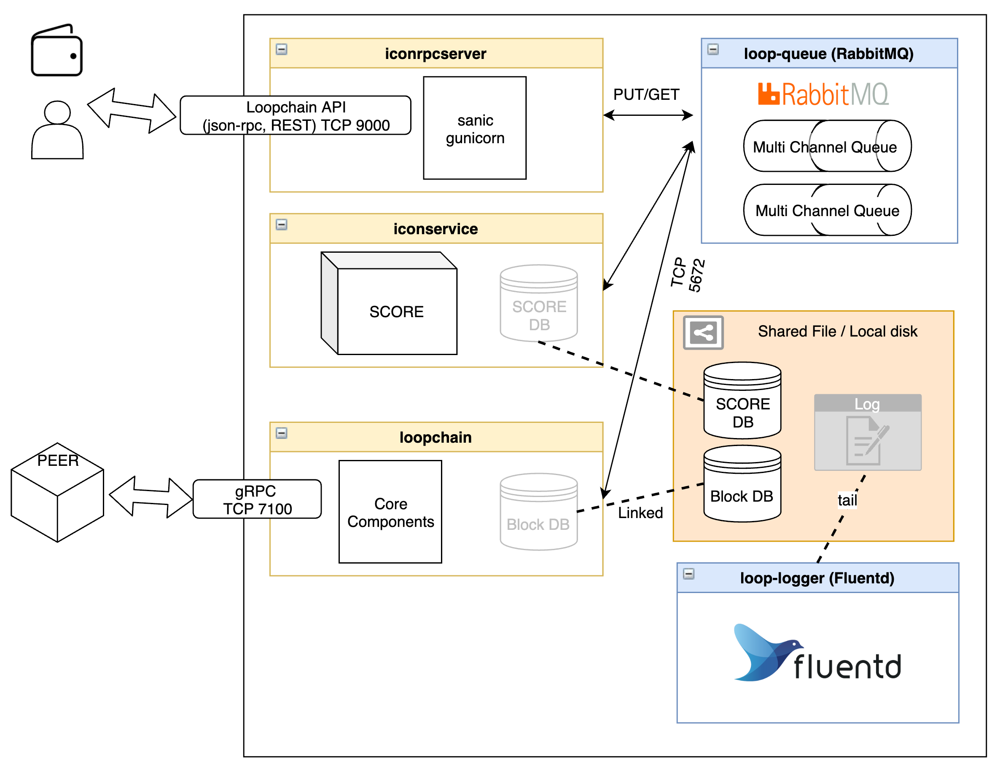

전반적인 설명 필요함

- P-Rep은 뭐다
- 아래의 내용은 용어 사전에서 발췌

P-Rep (Public Representative)  

A P-Rep, unlike a C-Rep, represents ICONists who do not belong to any specific Community.

It is elected by evidencing its sufficient contribution to the ICON Network or by receiving sufficient delegations from other ICONists.


The explanation of the P-Rep Network diagram as follow:   



Figure-1. P-Rep Networking Model


- Endpoint : https://preptest.net.solidwallet.io
- Tracker : [https://preptest.tracker.solidwallet.io](http://preptest.tracker.solidwallet.io/)
- IP List : https://download.solidwallet.io/conf/prep_iplist.json


We are recommend to use firewall to protect the P-Rep Node.

Each node communicates with a gRPC(TCP 7100) port and must have firewall which is open to each other.

Referring the IP list which is provided by the API, the firewall should allow TCP 7100, TCP 9000 of the IP address(es).


The explanation of the P-Rep Process as follow:  



Figure-2. P-Rep Architecture Diagram


What process is using P-Rep Node?

- iconrpcserver

  - iconrpcserver handles JSON-RPC message requests
  - ICON RPC Server receives request messages from external clients, and sends responses. when receiving the message, ICON RPC Server checks the method of requests and transfers it to appropriate components (loopchain or ICON Service). 

- iconservice :

  - ICON Service manages the state of ICON node including SCOREs using LevelDB.

    Before processing transactions, ICON Service checks for syntax errors, balances, etc.

- loopchain

  - Loopchain is the high-performance Blockchain Consensus & Network engine of ICON project

- loop-queue(RabbitMQ)

  - RabbitMQ is the most widely deployed open source message broker. 
  - RabbitMQ is the message queue which is used in loopchain 

- loop-logger(Fluentd)

  - Fluentd is the open source data collector, which lets you unify the data collection and consumption for a better usage and understanding of data.
  - You can use Fluentd if you want to centralize log 

Which ports is using P-Rep Node?

- TCP 7100 : gRPC port number of peer.  peer-to-peer connection requires establishment of a connection each between peer node.
- TCP 9000 : RESTful API port number. 
- TCP 5672 : RabbitMQ port number. 
- TCP 15672 : RabbitMQ Management will listen on port 15672. 
  - You can use RabbitMQ Management by enabling this port
  - It must be enabled before it can be used.
  - You can access to The management web console by  accessing to http://{node-hostname}:15672/.
  - For example, if want node runs on a  machine with the hostname of prep-node, you can access to the Management web console by accessing to  [http://prep-node:15672/](http://warp10.local:15672/) 


## Docker Quickstart

### Software Requirements

OS requirements

- Linux(CentOS 7 or Ubuntu 16.04 or newer)

Package requirements

- Docker: 18.x and above
- Python: 3.6.5 and above (included in the docker image)
- RabbitMQ: 3.7 and above (included in the docker image)

### Prerequisites

If you don't already have docker installed, you can download it here: <https://www.docker.com/community-edition>

- Logged in as a user with sudo privileges

> ## Install Docker & docker-Compose - Centos 7
>
> ### **Step 1 – Install Docker**
>
> Install necessary packages:
>
> $ sudo yum install -y yum-utils device-mapper-persistent-data lvm2
>
> 
>
> Configure the docker-ce repo:
>
> $ sudo yum-config-manager --add-repo https://download.docker.com/linux/centos/docker-ce.repo
>
> 
>
> Install docker-ce:
>
> $ sudo yum install docker-ce
>
> 
>
> Add your user to the docker group with the following command.
>
> $ sudo usermod -aG docker $(whoami)
>
> 
>
> Set Docker to start automatically at boot time:
>
> $ sudo systemctl enable docker.service
>
> 
>
> Finally, start the Docker service:
>
> $ sudo systemctl start docker.service
>
> 
>
> Then we'll verify docker is installed successfully by checking the version:
>
> $ docker version 
>
> ### **Step 2 — Install Docker Compose**
>
> Install Extra Packages for Linux
>
> $ sudo yum install epel-release
>
> 
>
> Install python-pip
>
> $ sudo yum install -y python-pip
>
> 
>
> Then install Docker Compose:
>
> $ sudo pip install docker-compose
>
> 
>
> You will also need to upgrade your Python packages on CentOS 7 to get docker-compose to run successfully:
>
> $ sudo yum upgrade python*
>
> 
>
> To verify the successful Docker Compose installation, run:
>
> $ docker-compose version
>
> ## **Install Docker & Docker Compose - ubuntu 16.04**
>
> ### **Step 1 – Install Docker**
>
> Update the apt package index:
>
> $ sudo apt-get update
>
> Install necessary packages:
>
> $ sudo apt-get install  -y systemd apt-transport-https ca-certificates curl gnupg-agent software-properties-common 
>
> 
>
> Add Docker's official GPG key:
>
> $ curl -fsSL <https://download.docker.com/linux/ubuntu/gpg> | sudo apt-key add -
>
> 
> Add the apt repository
> $ add-apt-repository "deb [arch=amd64] <https://download.docker.com/linux/ubuntu> $(lsb_release -cs) stable"
>
> 
>
> Update the apt package index:
>
> 
>
> $ sudo apt-get update
>
> 
>
> Install docker-ce:
>
> $ sudo apt-get -y install docker-ce docker-ce-cli containerd.io
>
> 
>
> 
>
> Add your user to the docker group with the following command.
>
> $ sudo usermod -aG docker $(whoami)
>
> 
>
> Set Docker to start automatically at boot time:
>
> $ sudo systemctl enable docker.service
>
> 
>
> Finally, start the Docker service:
>
> $ sudo systemctl start docker.service
>
> 
>
> Then we'll verify docker is installed successfully by checking the version:
>
> $ docker version
>
> 
>
> ### **Step 2 — Install Docker Compose**
>
> Install python-pip
>
> $ sudo apt-get install -y python-pip
>
> 
>
> Then install Docker Compose:
>
> $ sudo pip install docker-compose
>
> 
>
> To verify the successful Docker Compose installation, run:
>
> $ docker-compose version


## Running PRep-Node on Docker container

if you have docker installed, just follow the steps below

### Step 1. Pull the docker image

**Pull the latest stable version of an image.**

$ docker pull iconloop/prep-node:1904111713xdde258


**Step 2. Run the P-Rep Node as a Docker container**

**using docker command**

$ docker run -d  -p 9000:9000 -p 7100:7100 -v ${PWD}/[data:/data](http://data/data) iconloop/prep-node:1904111713xdde258


**using docker-compose command (Recommended)**

Open `docker-compose.yml` in a text editor and add the following content:

version: '3' services:    container:        image: 'iconloop/prep-node:1904111713xdde258'        container_name: 'prep-node'        volumes:            - ./[data:/data](http://data/data)        ports:           - 9000:9000           - 7100:7100


**Run docker-compose**

$ docker-compose up -d


**Learn more about these settings below.**

1. Forward port 7100, 9000

2. Mount volume to Docker image on OS   

3.  "-v ${PWD}/

   data:/data

   " 

    sets

    up a bindmount volume

    that links the /data/ 

   directory from inside the P-Rep Node container to the ${PWD}/data

    directory on the host machine.

   1. It has the following directory structure

.
`|---- data  `
`|     `---- PREP-TestNet   → Default ENV directory  `
`|          |---- .score_data  `
`|          |      |-- db      → root directory that SCORE will be installed`

```
|          |      |-- score   → root directory that state DB file will be created
|          |---- .storage     → root directory that block DB will be stored`
`|          `---- log          → root directory that log file will be stored
```


## Setup P-Rep Node

### Configuration

#### Start Node

Run docker-compose

$ docker-compose up -d

prep_prep_1 is up-to-date


The ``docker ps``  command shows running docker container. 

$ docker ps
CONTAINER ID   IMAGE                                                          COMMAND                CREATED              STATUS                          PORTS                                                                 NAMES
0de99e33cdc9     iconloop/prep-node:1904111713xdde258    "/src/entrypoint.sh"      2 minutes ago        Up 2 minutes(healthy)    0.0.0.0:7100->7100/tcp, 0.0.0.0:9000->9000/tcp prep_prep_1


| Column       | Description                                                  |
| :----------- | :----------------------------------------------------------- |
| CONTAINER ID | Container  ID                                                |
| IMAGE        | P-Rep Node's  image name                                     |
| COMMAND      | The Script will be executed first when a PRep-Node container is run |
| STATUS       | Healthcheck status. One of  "starting" , "healthy", "unhealthy" or "none" |
| PORTS        | Expose port on running P-Rep Node container                  |
| NAMES        | Container Name                                               |


You can read the container booting log.

$ tail -f data/PREP-TestNet/log/booting_20190419.log
[2019-04-19 02:19:01.454] DEFAULT_STORAGE_PATH=/data/PREP-TestNet/.storage
[2019-04-19 02:19:01.459] scoreRootPath=/data/PREP-TestNet/.score_data/score
[2019-04-19 02:19:01.464] stateDbRootPath=/data/PREP-TestNet/.score_data/db
[2019-04-19 02:19:01.468] P-REP package version info - 1904111713xdde258
[2019-04-19 02:19:02.125] iconcommons 1.0.5.1 iconrpcserver 1.2.6 iconservice 1.2.2 loopchain 2.1.2
[2019-04-19 02:19:07.107] Enable rabbitmq_management
[2019-04-19 02:19:10.676] Network: PREP-TestNet
[2019-04-19 02:19:10.682] Run loop-peer and loop-channel start
[2019-04-19 02:19:10.687] Run iconservice start!
[2019-04-19 02:19:10.692] Run iconrpcserver start!

#### Stop Node

$ docker-compose down

Stopping prep_prep_1 ... done
Removing prep_prep_1 ... done
Removing network prep_default


#### View Node State

$ curl localhost:9000/api/v1/status/peer

{
    "made_block_count": 0,
    "status": "Service is online: 0",
    "state": "Vote",
    "peer_type": "0",
    "audience_count": "0",
    "consensus": "siever",
    "peer_id": "hx1787c2194f56bb550a8daba9bbaea00a4956ed58",
    "block_height": 184,
    "round": 1,
    "epoch_height": 186,
    "unconfirmed_block_height": 0,
    "total_tx": 93, 
    "unconfirmed_tx": 0,
    "peer_target": "20.20.1.195:7100",
    "leader_complaint": 185,
    "peer_count": 5,
    "leader": "hx7ff69280a1483c660695039c14ba954bb101bb66",
    "epoch_leader": "hx7ff69280a1483c660695039c14ba954bb101bb66",
    "mq": {
         "peer": {
               "message_count": 0
          },
         "channel": {
               "message_count": 0
         },
         "score": {
              "message_count": 0
         }
     }
}


#### Docker Environment variables

If you want change the TimeZone setting, open `docker-compose.yml` in a text editor and add the following content:

version: '3' services:    container:        image: 'iconloop/prep-node:1904111713xdde258'        container_name: 'prep-node'        volumes:            - ./[data:/data](http://data/data)        ports:           - 9000:9000           - 7100:7100       environment:          TZ: "America/Los_Angeles"


The P-Rep Node image supports the following environment variable options:

| Variable            | Description                                                  | Default Value          | Allowed Value                |
| :------------------ | :----------------------------------------------------------- | :--------------------- | :--------------------------- |
| TZ                  | Setting the TimeZone Environment <https://en.wikipedia.org/wiki/List_of_tz_database_time_zones> | Asia/Seoul             | TZ database name             |
| IPADDR              | Setting the IP address                                       | Your public ip address | IP address                   |
| DEFAULT_PATH        | Setting the Default Root PATH                                | /data/PREP-TestNet     | PATH String                  |
| USE_MQ_ADMIN        | Enable RabbitMQ management Web interface.The management UI can be accessed using a Web browser at http://{node-hostname}:15672/.For example, for a node running on a machine with the hostname of prep-node, it can be accessed at [http://prep-node:15672/](http://warp10.local:15672/) | false                  | boolean(true / false)        |
| MQ_ADMIN            | RabbitMQ management username                                 | admin                  |                              |
| MQ_PASSWORD         | RabbitMQ management password                                 | iamicon                |                              |
| LOOPCHAIN_LOG_LEVEL | Loopchain Log Level                                          | INFO                   | DEBUG, INFO, WARNING, ERROR  |
| ICON_LOG_LEVEL      | iconservice Log Level                                        | INFO                   | DEBUG, INFO, WARNING, ERROR  |
| LOG_OUTPUT_TYPE     | Choose a log output type                                     | file                   | file, console, file\|console |
| RPC_WORKER          | Setting the number of RPC workers                            | 3                      | Number                       |
|                     |                                                              |                        |                              |


### Troubleshooting

#### How to check if container is running or not


The ``docker ps``  command shows running docker container. 

$ docker ps
CONTAINER ID   IMAGE                                                          COMMAND                CREATED              STATUS                          PORTS                                                                 NAMES
0de99e33cdc9     iconloop/prep-node:1904111713xdde258    "/src/entrypoint.sh"      2 minutes ago        Up 2 minutes(**healthy**)    0.0.0.0:7100->7100/tcp, 0.0.0.0:9000->9000/tcp prep_prep_1


container가 동작중인지, STATUS가 healthy인지 확인해봐야한다. 

To verify if the P-Rep is running, it check the condition of the container.

아래와 같은 규칙으로 컨테이너 내부에서 healthcheck를 수행하고 있고, 실패시에는 unhealthy라고 표시된다.

The health of P-Rep Node check script is the command that runs inside the container to check the health.

`healthcheck` script runs inside the container by

the following settings is the default setting of the health check script:


| option       | value |
| :----------- | :---- |
| retries      | 4     |
| interval     | 30s   |
| timeout      | 20s   |
| start-period | 60s   |


The container can have three states:

- starting - container starts
- healthy - healthy status when health check passes
- unhealthy -  unhealthy status when health check fails


**컨테이너가 실행하자마자 죽었거나 실행되지 않았을때는 아래와 같이 boot.log를  확인해야한다.**

**If the container is dead or not running as soon as it runs, check the boot.log as shown below.**

**If the container doesn't start, check the boot.log as fallow**

**컨테이너가 시작시에 문제가 생기면 실행되지 않고 중단된다.**


**success log messages example** 성공적인 로그 패턴 (정상 로그 패턴)

$ cat data/PREP-TestNet/log/booting_${DATE}.log 

[2019-04-19 02:19:01.435] Your IP: 20.20.1.195
[2019-04-19 02:19:01.439] RPC_PORT: 9000 / RPC_WORKER: 3
[2019-04-19 02:19:01.444] DEFAULT_PATH=/data/PREP-TestNet in Docker Container
[2019-04-19 02:19:01.449] DEFAULT_LOG_PATH=/data/PREP-TestNet/log
[2019-04-19 02:19:01.454] DEFAULT_STORAGE_PATH=/data/PREP-TestNet/.storage
[2019-04-19 02:19:01.459] scoreRootPath=/data/PREP-TestNet/.score_data/score
[2019-04-19 02:19:01.464] stateDbRootPath=/data/PREP-TestNet/.score_data/db
[2019-04-19 02:19:01.468] P-REP package version info - 1904111713xdde258
[2019-04-19 02:19:02.125] iconcommons 1.0.5.1 iconrpcserver 1.2.6 iconservice 1.2.2 loopchain 2.1.2
[2019-04-19 02:19:07.107] Enable rabbitmq_management
[2019-04-19 02:19:10.676] Network: PREP-TestNet
[2019-04-19 02:19:10.682] Run loop-peer and loop-channel start
[2019-04-19 02:19:10.687] Run iconservice start!
[2019-04-19 02:19:10.692] Run iconrpcserver start!


**How to find error**

**Error log messages example**

$ cat data/PREP-TestNet/log/booting_${DATE}.log | grep ERROR

[2019-04-19 02:08:48.746] [ERROR] Download Failed - <http://20.20.1.149:5000/cert/20.20.1.195_public.der> status_code=000

[2019-04-19 01:58:46.439] [ERROR] Unauthorized IP address, Please contact our support team


**Docker container stores below log files**

- booting.log

  →  The log file which contains any error when error conditions after  the docker container starts up.

- iconrpcserver.log

  →The log file which contains the information about requests/responses through the iconrpcserver. 

- iconservice.log

  → The log file which contains how ICONService works

- loopchain.channel-txcreator-icon_dex_broadcast.icon_dex.log

  → The log file which contains the broadcast log telling TX broadcast from a node to other nodes

- loopchain.channel-txcreator.icon_dex.log

  → The log file which contains process of confirming TX

- loopchain.channel-txreceiver.icon_dex.log

  → The log file which contains the process in which each nodes receive the broadcasted TX.

- loopchain.channel.icon_dex.log

  → The log file which contains the information about loopchain engine


#### **How to monitor** **resources**

We recommend the following tools for resource monitoring

1. Network monitoring - iftop, nethogs, vnstat
2. CPU/Memory monitoring - top, htop
3. Disk I/O monitoring - iostat, iotop
4. Docker monitoring - docker stats, ctop
