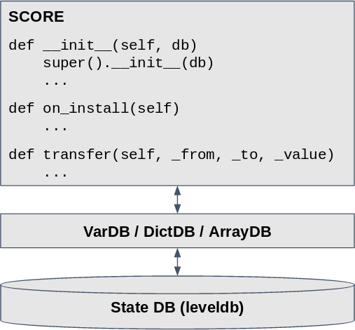

This document introduces the smart contract for ICON (a.k.a. SCORE) and describes what it is
and what characteristics and limitations are.

## ICON Smart Contract - SCORE

SCORE (Smart Contract on Reliable Environment) is a smart contract running on ICON network.
A smart contract is a collection of codes (functions) and data (states) that resides at a specific
address on the blockchain. SCORE can be regarded as a state transition machine that a user could
implement a service logic such as token transfers. The state transition is triggered by sending
transactions to an address that the SCORE resides. Any service logic that can be modeled by a
state transition machine can be implemented in the SCORE code.

A unique aspect of ICON SCORE is that its programming language is Python, a general purpose
programming language, it is easy to learn and already popular nowadays. So if you are already
familiar with Python language, you can write SCORE code right away without needing to learn
a new programming language. And SCORE provides a state DB abstraction like VarDB, DictDB and
ArrayDB that help you store your data to the state DB conveniently.

SCORE is initially deployed on the blockchain by sending a deploy transaction that holds compressed
binary data of the SCORE code. Once you deploy a SCORE on the ICON network successfully, the
SCORE will get a new address that starts with 'cx'. After that, you can send a transaction
to the address of SCORE.  Unlike other blockchain system, the deployed SCORE can be updated,
and the corresponding SCORE address still remains the same even after the update.

SCORE must follow sandbox policy, i.e. some operations like file system access or network
API calls are strictly prohibited. A transaction sent from a user will be executed on every
node that exists on the ICON network.  And the nodes will form consensus on the transaction
result. So deterministic behavior is very important aspect when you write SCORE code, because
every node should agree on the execution result. Therefore you cannot use a random operation
like using random() function, cannot make network call that may get different results depending
on the connection, cannot make system call that results may also differ between nodes. Also,
you cannot do long-running operations in SCORE, that may prevent forming consensus between
nodes. These sandbox policies should be obeyed by every SCORE programmer.

## Limitations

- SCORE code size is limited to about 64 KB (actually bounded by the maximum step limit value
  during processing its deploy transaction) after being compressed.
- The maximum count of inter-SCORE call or ICX transfer/send is 1024 in one transaction.
- The maximum stack size that a SCORE can call external functions recursively is 64 in one transaction.
- Declaring member variables which are not managed by the state DB is prohibited.
